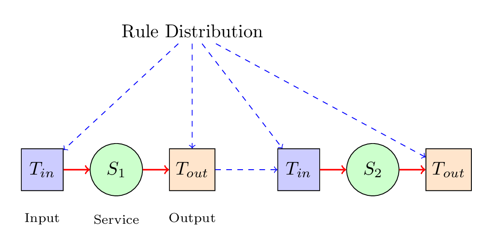

# Rule-Propagated-Service-Orchestration

RPSO is a decentralized workflow orchestration architecture that eliminates central coordination bottlenecks by embedding orchestration logic as executable rules at service or mesh boundaries. Unlike traditional orchestrators that maintain global workflow state in a central engine, RPSO distributes coordination intelligence to autonomous service nodes that make local routing decisions based on locally-cached rules while maintaining global workflow coherence through token-based state propagation. The architecture operates through a two-phase approach: compile-time transformation of declarative JSON workflow specifications into service-specific rule fragments, followed by runtime execution where services independently evaluate rules to determine routing without inter-service coordination. 

## Overview

Rather than services being passive executors controlled by a remote orchestrator, coordination intelligence is embedded in control nodes (*T_in* and *T_out*) at service boundaries. Services remain focused on business logic while the control nodes make autonomous routing decisions based on locally-executed rules, maintaining global workflow coherence through token-based state propagation.  The service or computation node is not touch by the control nodes except to invoke them.  The dotted lines notate network connections.



*Dual-layer architecture: Rule distribution (compile-time) and token flow (runtime)*

## Key Features

- **Distributed Orchestration** - No central engine bottleneck or single point of failure
- **Rule-Based Coordination** - Services execute RuleML rules locally via OOjDREW engine
- **Token-Based State** - Workflow state propagates with tokens, eliminating external state stores
- **Bounded Failure Impact** - Node failures affect only dependent workflows (20-33%) vs 100% in centralized systems
- **Concurrent Versioning** - Multiple workflow versions (RuleBases v001, v002, v003, etc) execute simultaneously
- **Geographic Distribution** - Native support for distributed deployments

## Architecture

The system implements a two-layer architecture:

- **Rule Deployment Layer** (compile-time)
- **Token Flow Layer** (runtime)

### Rule Deployment Layer
 At deployment time, the RulePropagation component transforms JSON workflow specifications into service-specific rule fragments. Each service receives rules defining its coordination behavior (NodeType atoms), routing conditions (meetsCondition atoms), and decision values (DecisionValue atoms). These rules can occur in real-time whilst other process are still in flight.  They are distributed via UDP with a commitment protocol ensuring all services acknowledge receipt before workflow activation is allowed.


### Token Flow Layer
At runtime, an xml payload traverses the network carrying both workflow state and accumulated business data.  Each **Control Node** reads the payload (*T_in*) and prioritises and buffers the arriving tokens that carries the service's operation arguments.   Once the service has been invoked the results enrich the token, and then EventPublisher (*T_out*) querying local OOjDREW rule engine for routing decisions to downstream services.

### Control Node - Core Components

| Component | Description |
|-----------|-------------|
| ServiceThread | Embedded orchestrator coordinating all components |
| EventReactor | UDP-based token reception with buffering |
| Rule Handler | Receives and validates rule fragments |
| OOjDREW Engine | RuleML query processing for routing decisions |
| EventPublisher | Intelligent token routing to downstream services |
| ServiceHelper | Multi-protocol service invocation |

### Coordination Patterns

- **GatewayNode** - XOR-based routing guards
- **DecisionNode** - Conditional routing based on service results
- **ForkNode** - Parallel service invocation
- **JoinNode** - Correlation-based synchronization
- **MergeNode** - Flexible input handling

### Service Defintions (RuleBase)
Services Names and Operations are defined as RuleML atoms, where ip0 is mapped to an IP address, and the last entry represents the port number, for example

<!-- List of service facts -->

```xml
<!-- List of service facts -->

<!-- Triage Service -->
<Atom>
	<Rel>activeService</Rel>
	<Ind>TriageService</Ind>
	<Ind>processTriageAssessment</Ind>
	<Ind>ip0</Ind>
	<Ind>2100</Ind>
</Atom>

<!-- Radiology Service -->
<Atom>
	<Rel>activeService</Rel>
	<Ind>RadiologyService</Ind>
	<Ind>processImagingRequest</Ind>
	<Ind>ip0</Ind>
	<Ind>2101</Ind>
</Atom>

<Atom>
	<Rel>activeService</Rel>
	<Ind>RadiologyService</Ind>
	<Ind>federatedRadiologyRequest</Ind>
	<Ind>ip0</Ind>
	<Ind>2102</Ind>
</Atom>
```


## Project Structure

```
├── btsn.common/                    # Shared libraries and rules
│   ├── src/org/btsn/              # Common source code
│   ├── lib/                        # Dependencies
│   ├── RuleBase/                   # Rule definitions
│   ├── ServiceAttributeBindings/   # Service bindings
│   └── serviceLoaderQueries/       # Loader configurations
│
├── btsn.healthcare.places.Triage/      # Triage service
├── btsn.healthcare.places.Cardiology/  # Cardiology service
├── btsn.healthcare.places.Diagnosis/   # Diagnosis service
├── btsn.healthcare.places.Laboratory/  # Laboratory service
├── btsn.healthcare.places.Radiology/   # Radiology service
└── btsn.healthcare.places.Treatment/   # Treatment service
```

## Requirements

- Java 15+
- Apache Ant
- OOjDREW rule engine
- Derby/MySQL (optional)

## Building

Each service can be built independently:

```bash
cd btsn.healthcare.places.Triage
ant clean release
```

This produces a distributable ZIP containing the service JAR, dependencies, and launch scripts.

## Configuration

### Rule Distribution

Rules are distributed via UDP with version-based port calculation:
- Rule listener: port 20000 + (channel × 1000) + basePort
- Commitment acknowledgment: port 30000

### Service Registration

Services register via RuleML atoms:

```xml
<!-- Local deployment (multicast) -->
<Atom><Rel>hasOperation</Rel>
  <Ind>DiagnosisService</Ind>
  <Ind>processClinicalDecision</Ind>
  <Ind>a4</Ind>
  <Ind>1024</Ind>
</Atom>

<!-- Remote deployment -->
<Atom><Rel>activeService</Rel>
  <Ind>DiagnosisService</Ind>
  <Ind>processClinicalDecision</Ind>
  <Ind>ip0</Ind>
  <Ind>1020</Ind>
</Atom>
```

## Validation Scenario

The implementation includes an emergency department workflow with three paths:

1. **Fast Track** - Direct triage to treatment (20% of cases)
2. **Comprehensive** - Triage → {Radiology, Laboratory, Cardiology} → Diagnosis → Treatment
3. **Federated** - External radiology requests from other hospitals

## Tutorial: Running the Traffic Lights Simulation

1. Expand project **btsn.petrinet.ProjectLoader**

2. Run the Ant build file **TrafficLight_BuildAndRun**

3. When complete, open project **btsn.common.Monitor**, then open `org.btsn.derby.Analysis` and run **PetriNetAnalyzer** to confirm the analysis was captured and valid

4. Copy the analysis results to: `btsn.common/AnalysisFolder/PetriNet/Analysis_TrafficLights.txt`

5. To run the animator, open **btsn.ProcessEditor/com/editor/ProcessEditor**

6. Open the local ProcessDefinitionFolder in common and select the process: `PetriNet/TrafficLights.json`

7. Load the analysis file from the Analysis folder where the run was saved

8. Press **Run** to see the simulation results

## License

[Specify license]

## Author

Alexander Cameron
