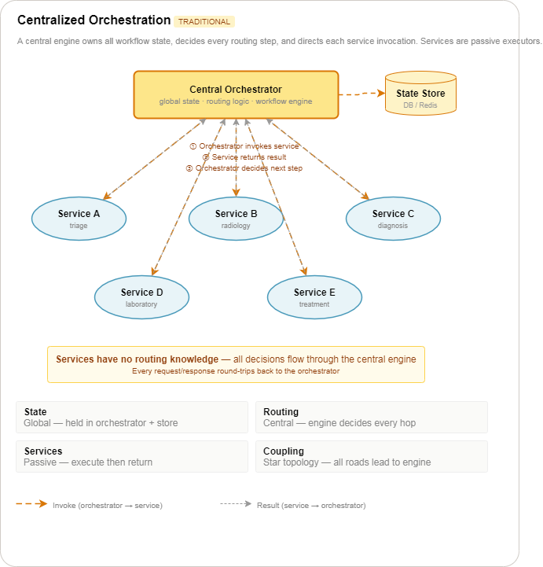
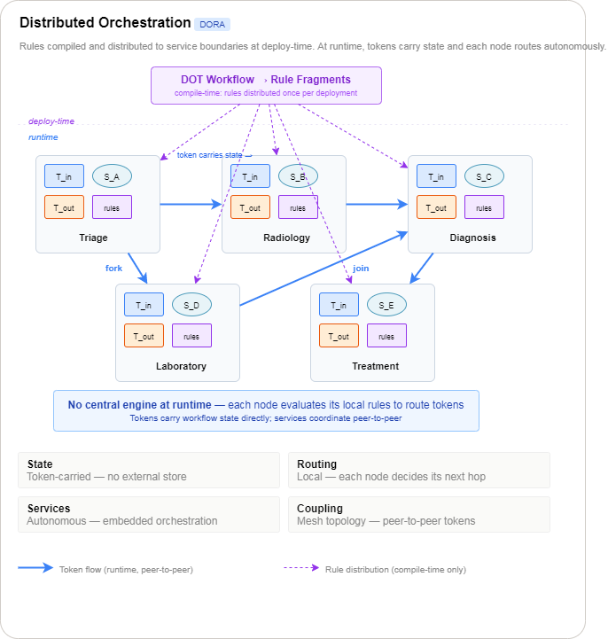
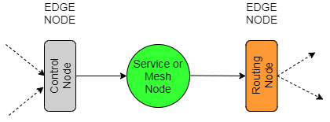
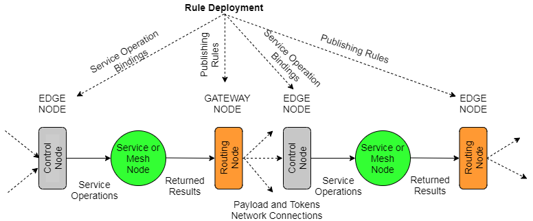
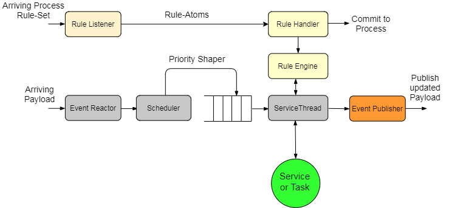
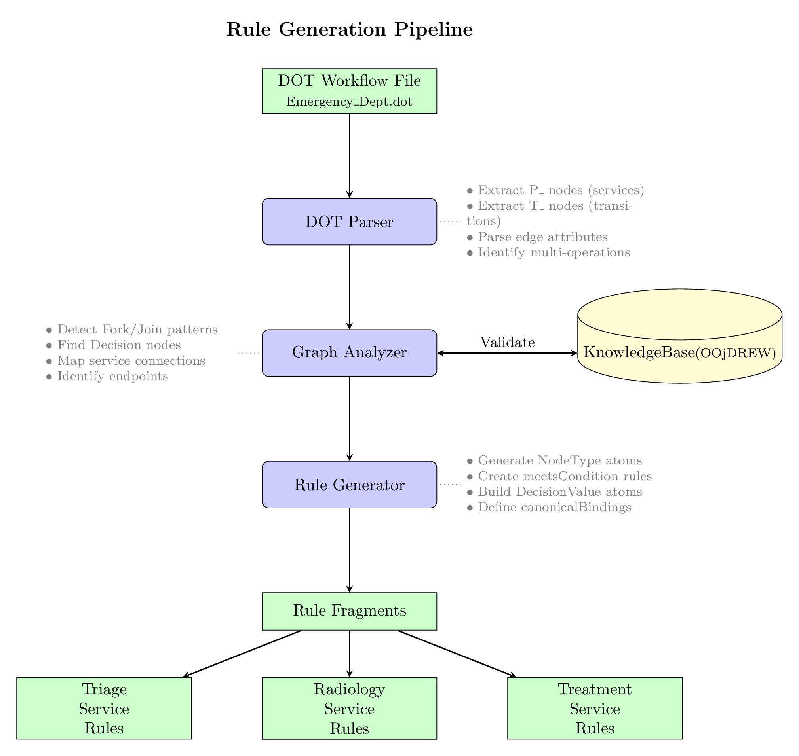
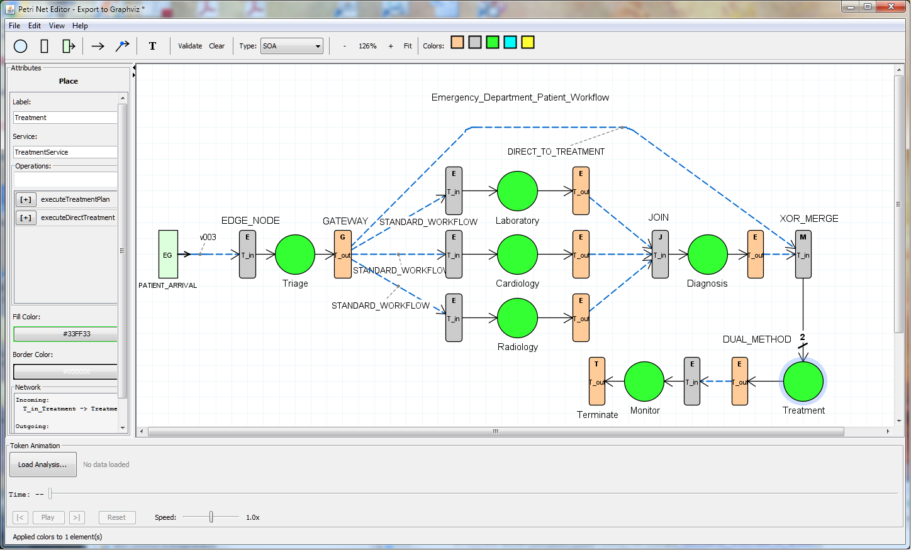

# Introduction
If you just want to try out the RPSO infrastructure without wading through all the detail, a tutorial on how to use the tools and the infrastructure can be found here [Link to tutorial](Tutorial.md).  Otherwise the next section provide an insight into why a change in the approach the service or mesh orchestration is needed and a brief description of how it can be applied to your particular network.  

# The Concept

## Centralised Orchestration
<p align="center">
  
</p>

## Decentralised Orchestration
<p align="center">
  
</p>


# Rule-Propagated-Service-Orchestration

RPSO is a decentralized workflow orchestration infrastructure that eliminates central coordination bottlenecks by embedding orchestration logic as executable rules at service or mesh boundaries. Unlike traditional orchestrators that maintain global workflow state in a central engine, RPSO distributes coordination intelligence to autonomous synchronising nodes that are ideally, but not essentially, co-hosted on the service node or mesh platform as a set of Java classes (handlers). These control nodes make local routing decisions based on locally-cached rules while maintaining global workflow coherence through an xml payload that carries token-based state propagation. The architecture operates through a two-phase approach: compile-time transformation of declarative JSON workflow specifications into service-specific rule fragments, followed by runtime execution where control nodes independently evaluate rules to determine routing without inter-service coordination. 


<p align="center">
  
</p>

*Figure 1. Core orchestration pattern*

## Overview

The control nodes is are implemented with the notation  *T_in* and the routing node annotated as *T_out* as shown in the figure below. The dotted arrows between *T_out and *T_in reflects that generally network connections of some sort.  Services remain focused on business logic while the control nodes make autonomous routing decisions based on locally-executed rules.  These rule are sent to the control nodes prior to a particular workflow commencing. In this manner global workflow coherence can be maintained through token-based state propagation between control and routing nodes.  The service or computation node is not touch by the control nodes except to invoke them.  The dotted lines notate network connections.


<p align="center">
  
</p>

*Figure 2. Dual-layer architecture: Rule distribution (compile-time) and token flow (runtime)*

## Java Implementation

The Java classes that implement the architecture interfaces are build on standard event patterns however the *ServiceThread*  performs the bulk of the activities of managing the incoming payload data and performing node type joins, routing etc and most importantly determining if it the requested invocation is valid.  Following invocation the results are passed to the routing handler for looking up the publishing rules and routing to the next service in the workflow. 


<p align="center">
  
</p>

*Figure 3. Java Implementation Handler Classes.*

### Control Node - Core Components

| Component | Description |
|-----------|-------------|
| EventReactor | UDP-based token reception with buffering |
| Scheduler | Order according to ruleBase Version and Join Priority |
| ServiceThread | Embedded orchestrator coordinating all components |
| Rule Handler | Receives and validates rule fragments |
| OOjDREW Engine | RuleML query processing for routing decisions |
| EventPublisher | Intelligent token routing to downstream services |
| ServiceHelper | Multi-protocol service invocation |


## High Level Architecture Concepts

The system implements a two-layer architecture:

- **Rule Deployment Layer** (compile-time)
- **Token Flow Layer** (runtime)

### Rule Deployment Layer
 At deployment time, the RulePropagation component transforms JSON workflow specifications into service-specific rule fragments. Each service receives rules defining its coordination behavior (NodeType atoms), routing conditions (meetsCondition atoms), and decision values (DecisionValue atoms). These rules can occur in real-time whilst other process are still in flight.  They are distributed via UDP with a commitment protocol ensuring all services acknowledge receipt before workflow activation is allowed.


*Figure 4. Rule Fragments Deployment Flow*

### Token Flow Layer
At runtime, an xml payload traverses the network carrying both workflow state and accumulated business data.  Each **Control Node** reads the payload (*T_in*) and prioritises and buffers the arriving tokens that carries the service's operation arguments.   Once the service has been invoked the results enrich the token, and then EventPublisher (*T_out*) querying local OOjDREW rule engine for routing decisions to downstream services.

### Payload Structure

The inter-service payload is an **XML document** with four main sections:

```xml
<payload>
    <header>...</header>
    <service>...</service>
    <joinAttribute>...</joinAttribute>
    <monitorData>...</monitorData>
</payload>
```

### Sections

| Section | Purpose | Key Fields |
|---------|---------|------------|
| `<header>` | Routing & versioning | `sequenceId`, `ruleBaseVersion`, `monitorIncomingEvents` |
| `<service>` | Target service info | `serviceName`, `operation` |
| `<joinAttribute>` | Token data | `attributeName`, `attributeValue`, `notAfter` |
| `<monitorData>` | Instrumentation | `processStartTime`, `eventGeneratorTimestamp`, `sourceEventGenerator`, `processElapsedTime` |

### Token Data Flow

1. **Incoming** — `ServiceThread` extracts maps via XPath:
   ```java
   headerMap = xph.findMultipleXMLItems(incomingXMLPayLoad, "//header/*");
   attrMap = xph.findMultipleXMLItems(incomingXMLPayLoad, "//joinAttribute/*");
   ```

2. **Service invocation** — Token data passed to service via `attributeValue`

3. **Outgoing** — Maps updated and written back to XML:
   ```java
   outgoingXMLPayLoad = xph.modifyMultipleXMLItems(outgoingXMLPayLoad, "//service/*", serviceMap);
   outgoingXMLPayLoad = xph.modifyMultipleXMLItems(outgoingXMLPayLoad, "//joinAttribute/*", attrMap);
   ```

4. **Publish** — `EventPublisher` sends payload to next service's channel/port

*Key Point*

The **token identity** (`sequenceId`) and **token value** (`attributeValue`) travel together in the payload, allowing join synchronization via `argValPriorityMap` keyed by join ID.


### Coordination Patterns

- **GatewayNode** - XOR-based routing guards
- **DecisionNode** - Conditional routing based on service results
- **ForkNode** - Parallel service invocation
- **JoinNode** - Correlation-based synchronization
- **MergeNode** - Flexible input handling

### Service Definitions (RuleBase)
Services Names and Operations are defined as RuleML atoms, where ip0 is mapped to an IP address, and the last entry represents the port number, for example


```xml
<!-- List of service facts -->
<!-- Triage Service Method -->
<Atom>
	<Rel>activeService</Rel>
	<Ind>TriageService</Ind>
	<Ind>processTriageAssessment</Ind>
	<Ind>ip0</Ind>
	<Ind>2100</Ind>
</Atom>
```
### Canonical Bindings (ServiceAttributeBindings)
Services arguments are defined in a similar manner the Service Definitions. 

The definition of service attributes is done on the basis *"if you want to talk to me you must call my operations with the following arguments and I will return the following values"*.  This form of compartmentalisation makes routing straight forward.  In the example below we can see that the ```DiagnosisService``` method ```processClinicalDecision``` requires three arguments, ```cardiologyResults```  , ```laboratoryResults``` and ```radiologyResults```.  In the workflow definition of this process this would represent a ```Join Node```.

```xml

<!-- Canonical Binding Service and Operation facts -->
<Atom>
	<Rel>localDefined</Rel>
	<Ind>DiagnosisService</Ind>
</Atom>

<Atom>
    <Rel>canonicalBinding</Rel>
    <Ind>processClinicalDecision</Ind>
    <Ind>diagnosisResults</Ind> <!-- This is the attribute returned -->
    <Ind>cardiologyResults</Ind> <!-- This is the attribute needed -->
</Atom>
<Atom>
    <Rel>canonicalBinding</Rel>
    <Ind>processClinicalDecision</Ind>
    <Ind>diagnosisResults</Ind> <!-- This is the attribute returned -->
    <Ind>laboratoryResults</Ind> <!-- This is the attribute needed -->
</Atom>
<Atom>
    <Rel>canonicalBinding</Rel>
    <Ind>processClinicalDecision</Ind>
    <Ind>diagnosisResults</Ind> <!-- This is the attribute returned -->
    <Ind>radiologyResults</Ind> <!-- This is the attribute needed -->
</Atom>
```

## Project Structure

```
├── btsn.common/                    # Shared libraries and rules
│   ├── src/org/btsn/              # Common source code
│   ├── lib/                        # Dependencies
│   ├── RuleBase/                   # Rule definitions
│   ├── ServiceAttributeBindings/   # Service bindings
│   └── serviceLoaderQueries/       # Loader configurations
│
├── btsn.healthcare.places.Triage/      # Triage service
├── btsn.healthcare.places.Cardiology/  # Cardiology service
├── btsn.healthcare.places.Diagnosis/   # Diagnosis service
├── btsn.healthcare.places.Laboratory/  # Laboratory service
├── btsn.healthcare.places.Radiology/   # Radiology service
└── btsn.healthcare.places.Treatment/   # Treatment service
```

## Requirements

- Java 15+
- Apache Ant
- OOjDREW rule engine
- Derby (Embedded)

## Building a Project

Each service or mesh project is normally built by the IDE, for example Eclipse.   If you wish to run the service on another host the project can be built independently by running

 ```Ant build.xml ```:

This produces a distributable ZIP containing the service JAR, dependencies, and launch scripts. This allows a service or build to be deployed to any host on the network.

For example to build the Triage service with its Control Node navigate to `btsn.healthcare.places.Triage` and then run `build.xml`.   This will generate the zip file `btsn.places.Triage-1.0.zip` which you can copy to any platform.  Running `launch.bat` will load the complete application.  It just remains then to launch any one of the process workflows defined in the `btsn.healthcare.ProjectLoader` directory.

## Validation Scenario

The implementations includes a healthcare emergency department workflow along with simple Petri Net type services workflow.  An example of a practical  process workflow is shown below in Figure 5. 


*Figure 5. Emergency_Department_Patient_Workflow.*

## Tutorial: Running the Healthcare Workflow

If you would just like to run an existing animation you do not need to build and run the process, you can just go straight to step 5.

### Running the Emergency_Department_Patient_Workflow

1. Expand project `btsn.healthcare.ProjectLoader`

2. Run the Ant build file `Emergency_Department_BuildAndRun`

3. When complete, open project `btsn.common.Monitor`, then open `org.btsn.derby.Analysis` and run `PetriNetAnalyzer` to confirm the analysis was captured and valid

4. Copy the analysis results to: `btsn.common/AnalysisFolder/Healthcare/Emergency_Department_Patient_Workflow.txt`

### Animating a Process

5. To run the animator, open `btsn.WorkflowEditor/com/editor/ProcessEditor`

6. Now we need to load the workflow defintion file in the process editor.  Open the workflow definition folder `ProcessDefinitionFolder/healthcare/Workflow` in `btsn.common` and navigate to select the process: `Emergency_Department_Patient_Workflow.json`

7. Load the analysis file from the Analysis, e.g. `btsn.common/AnalysisFolder/Healthcare/Emergency_Department_Patient_Workflow.txt`

8. Press **Play** to see the simulation results


# License

**Copyright (c) 2025 [Alexander Cameron]**

Permission is hereby granted, free of charge, to any person obtaining a copy of this software and associated documentation files (the "Software"), to use, copy, modify, merge, and distribute the Software for non-commercial purposes, subject to the following conditions: the above copyright notice and this permission notice shall be included in all copies or substantial portions of the Software.

**Commons Clause Restriction:** The grant of rights under this license does not include the right to Sell the Software. "Sell" means providing the Software, or any derivative work, to third parties for a fee or other consideration, or offering a product or service whose value derives substantially from the Software's functionality. For commercial licensing enquiries, contact [your email].

THE SOFTWARE IS PROVIDED "AS IS", WITHOUT WARRANTY OF ANY KIND, EXPRESS OR IMPLIED.

## Author

Alexander Cameron
