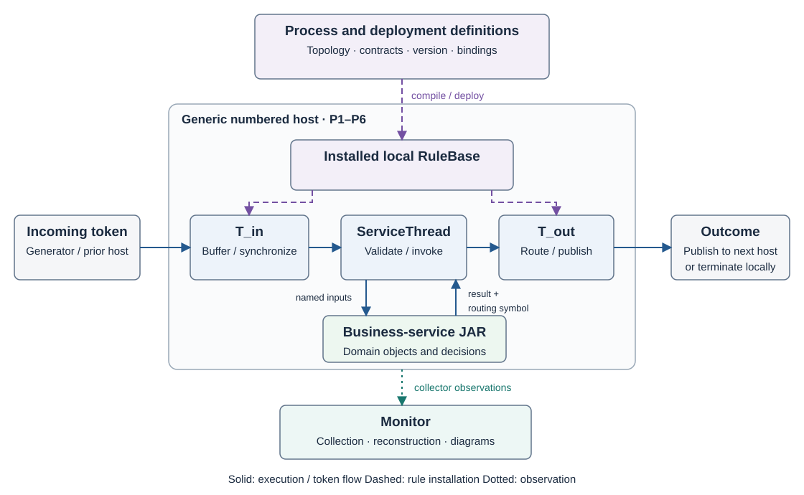
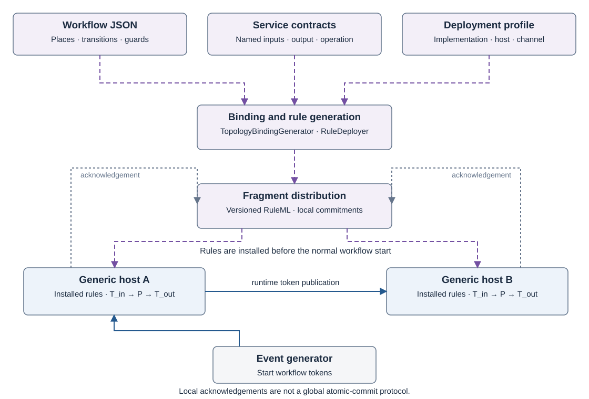
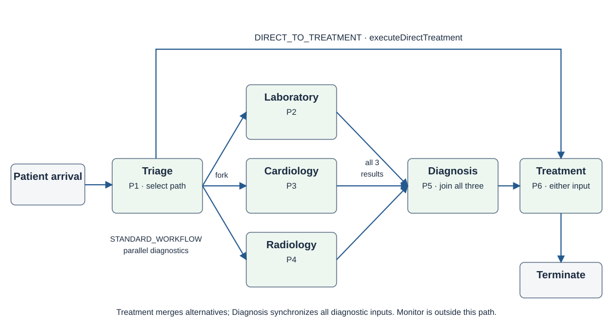
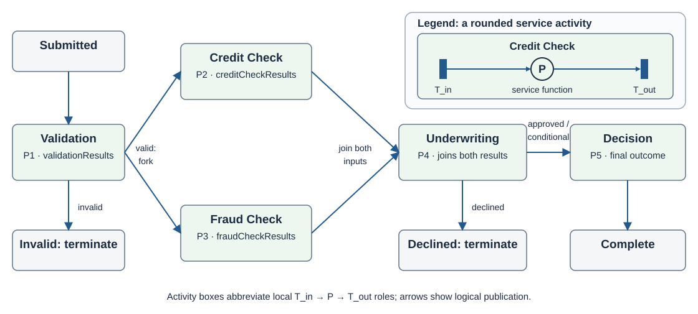
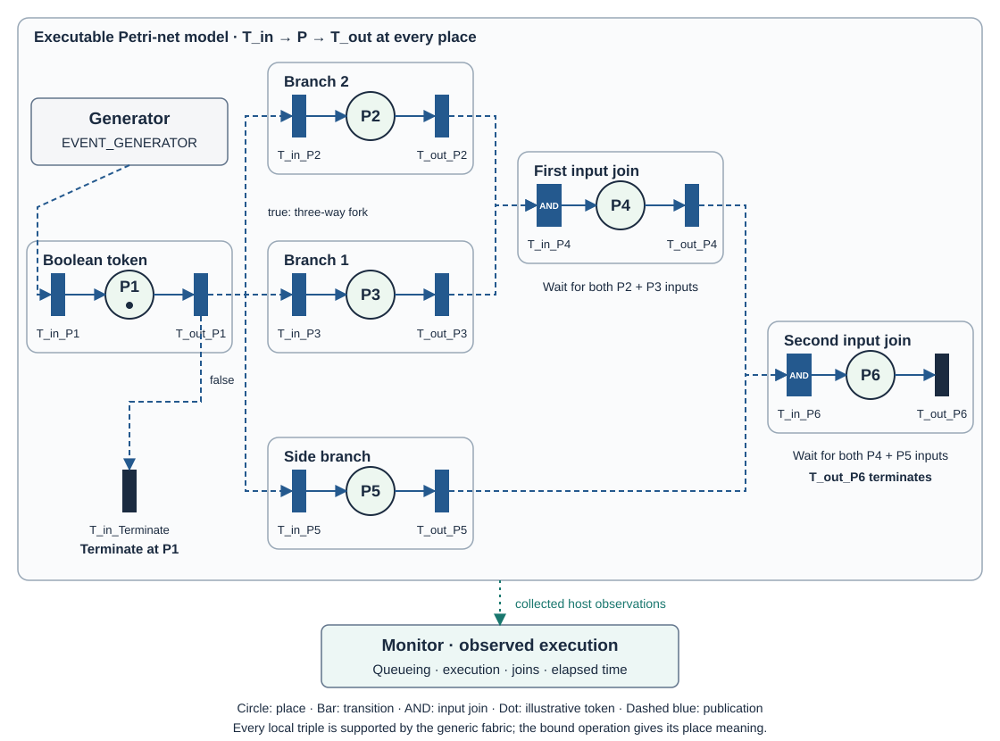
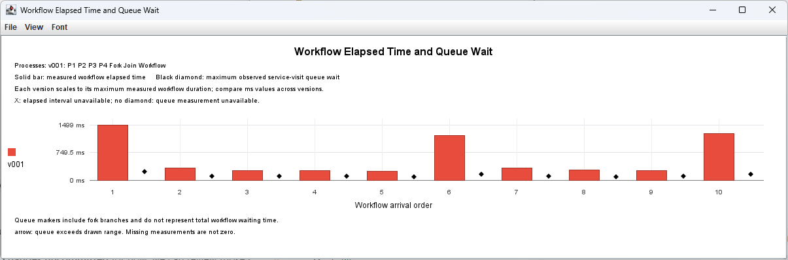
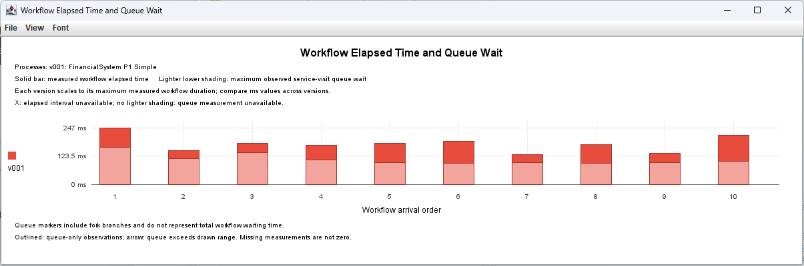
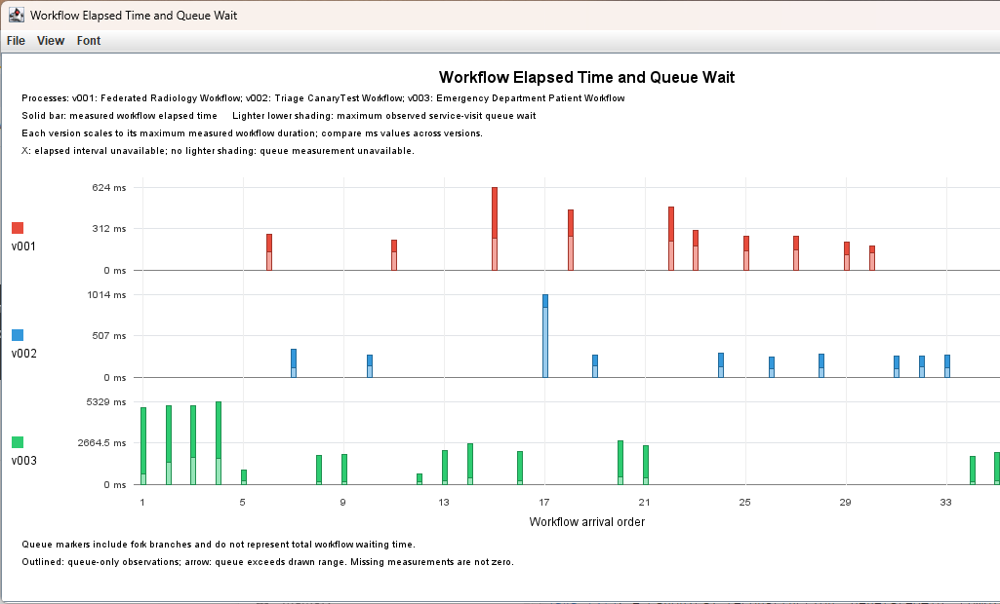

# Rule-Propagated Service Orchestration (RPSO)

RPSO is an executable Petri-net architecture for distributed business processes.
It separates **process coordination** from **business computation**: a declarative
workflow describes the allowed paths, generic orchestration hosts buffer and
synchronize tokens, and independently packaged services perform domain operations.

The repository contains healthcare, Financial and Petri-net model examples, a
workflow editor, Ant build-and-run launchers, and observation/analysis tools.

## Run an example

1. Use **JDK 15+** and **Apache Ant 1.10.2+**. In Eclipse, ensure the Ant launch uses
   a JDK so the Java compiler is available.
2. Import the repository's projects with **File → Import → General → Existing
   Projects into Workspace**, leaving **Copy projects into workspace** unchecked.
   Existing workspaces should also import `btsn.services`, the generic
   `btsn.rpso.places.p1`–`p6` projects, and `btsn.financial.ProjectLoader`.
3. Choose a launcher below, right-click the XML and select **Run As → Ant Build**.
   Use its default `run-complete-workflow` target. It builds the required JARs,
   prepares the configured runtime, starts local components, runs the workflow
   phases and collects observations. No separate `clean`/`package` step is needed.
4. After collection, run the launcher's `analyse` target or run `PetriNetAnalyzer`
   in `btsn.common.Monitor`, package `org.btsn.derby.Analysis`.

| Example | Ant entry point |
|---|---|
| Single-place tutorial | [P1_Tutorial_BuildAndRun.xml](btsn.petrinet.ProjectLoader/P1_Tutorial_BuildAndRun.xml) |
| P1–P4 fork/join model | [P1_P2_P3_P4_BuildAndRun.xml](btsn.petrinet.ProjectLoader/P1_P2_P3_P4_BuildAndRun.xml) |
| Live six-place double-join model | [P1_to_P6_Double_Join_Workflow.xml](btsn.petrinet.ProjectLoader/P1_to_P6_Double_Join_Workflow.xml) |
| Emergency department | [Emergency_Department_BuildAndRun.xml](btsn.healthcare.ProjectLoader/Emergency_Department_BuildAndRun.xml) |
| Full Financial application | [FinancialSystem_P1_P5_BuildAndRun.xml](btsn.financial.ProjectLoader/FinancialSystem_P1_P5_BuildAndRun.xml) |
| Concurrent healthcare versions | [Triple_Workflow_Emergencey_Department_Concurrent.xml](btsn.healthcare.ProjectLoader/Triple_Workflow_Emergencey_Department_Concurrent.xml) |

The concurrent launcher's existing filename includes `Emergencey`; use the file
as named. The loader guides list further scenarios and phase-only targets:
[healthcare](btsn.healthcare.ProjectLoader/README.md),
[Financial](btsn.financial.ProjectLoader/README.md), and
[Petri-net models](btsn.petrinet.ProjectLoader/README.md).

Local/remote startup follows the launcher's deployment profile. In `auto` mode,
the configured channel address must belong to this machine for a component to
start locally. Remote hosts must already be running with the matching JARs and
configuration. Stop the previous Ant run before starting another launcher on the
same ports. Initialization targets reset the selected runtime databases; collect
or archive results before starting a fresh initialized run.

For an editable model walkthrough, see [Tutorial.md](Tutorial.md).

## Architecture: coordination and business meaning



*Responsibility boundaries in the current Java implementation. Business-service
JARs are invoked in-process inside a numbered host. The dashed path configures
local rules; the dotted path carries collected observations outside the business
workflow.*

| Layer | Responsibility | Repository artefacts |
|---|---|---|
| Process model | Places, transitions, fork/join structure, guards and termination | `btsn.common/ProcessDefinitionFolder` |
| Service contract | Logical service identity, operations, named inputs and returned attribute | `BusinessServiceDefinitions`, `ServiceAttributeBindings` in `btsn.common` |
| Deployment | Map capabilities to implementation classes, hosts and channels | Infrastructure definitions and `btsn.services/deployments/{healthcare,financial,models}` |
| Generic execution fabric | Transport, buffering, synchronization, version selection, invocation and publication | `btsn.rpso.places.p1`–`p6`, shared infrastructure |
| Business computation | Domain objects, calculations and decision symbols | `btsn.common/src/org/btsn/business`, packaged as independent service JARs |
| Observation | Collect records, reconstruct workflow families and display measurements | `btsn.common.Monitor` |

A business service consumes its named inputs and returns a result. Where routing
is conditional, the result includes a symbol such as `approved` or `declined`.
The service interprets business meaning; the fabric matches the symbol against
declared routes and resolves the destination. Logical service identity is
separate from physical placement: P1 can host a clinical, financial or model
capability according to the selected deployment.

The execution pattern is **T_in → P → T_out**:

- **T_in** receives and buffers inputs, accumulating the required named values
  for joins. Readiness also depends on version, validity and available capacity.
- **P** invokes the bound business operation under the local execution capacity.
- **T_out** applies the installed routing rules, publishes fork children or
  records a business termination.

These are semantic roles within the local execution machinery. Activity boxes in
the diagrams abbreviate those roles; the arrows represent logical publications,
not a complete classical bipartite place/transition net. A process editor model
retains the explicit transition and place nodes.

There is no central engine making every runtime routing decision. Hosts use
local rule fragments and communicate through tokens. This does not imply absence
of distributed coordination, unlimited scalability, or a proven workflow
soundness property. Shared-host queues, transport and deployment remain relevant.

## Rule deployment and token execution



*Rule installation and runtime token flow are separate paths. Local installation
acknowledgements are not a global atomic-commit protocol.*

`TopologyBindingGenerator` derives operation bindings from the workflow.
`RuleDeployer` compiles/distributes versioned RuleML fragments to the participating
host operations and waits for local acknowledgements with retries in the normal
deployment path. Launchers that explicitly skip deployment require previously
installed matching rules. RuleBase version selection does not by itself pin the
business implementation binary; deploy the matching JARs and configuration too.

Runtime XML payloads carry token identity, workflow version, target operation,
named business attributes, validity and instrumentation fields. A fork creates
physical child tokens within one logical workflow family. Joins accumulate the
required inputs for that family; the analyzer uses recorded generated roots and
parent/child genealogy rather than treating every child as a new workflow.

| Component | Current role |
|---|---|
| `EventReactor` / `Scheduler` | Receive packets and maintain the local eligible-work ordering |
| `ServiceThread` | Validate the selected contract/version, coordinate inputs, invoke and publish |
| `RuleHandler` / OOjDREW | Install local RuleML and evaluate rule queries |
| `ServiceHelper` | Resolve and invoke the installed business implementation |
| `EventPublisher` | Send the resulting payload to the declared channel |

Priority applies to **waiting eligible work**. It does not interrupt a running
business operation. Different path lengths or different host operations can have
different queue waits without demonstrating priority overtaking. For controlled
same-queue evidence, run
[Queue_Priority_BuildAndRun.xml](btsn.healthcare.ProjectLoader/Queue_Priority_BuildAndRun.xml);
[its guide](btsn.healthcare.ProjectLoader/README.md#controlled-queue-priority-experiment)
explains the observed-backlog probe and its separate output files.

## Example processes and Petri-net models

### Emergency department



Triage either publishes directly to Treatment or forks to Laboratory, Cardiology
and Radiology. Diagnosis waits for all three named results. Treatment accepts the
diagnosis path or the direct triage path through distinct operations, then ends
the patient workflow. See [the healthcare mapping](btsn.services/docs/HEALTHCARE.md)
for contracts and host assignments.

### Financial loan application



Validation rejects invalid applications or forks into Credit Check and Fraud
Check. Underwriting joins their named results. `approved` and `conditional`
proceed to Decision; `declined` terminates early. See
[the Financial application guide](btsn.common/FinancialApplication.md) for contracts.

### Live Petri-net model execution



RPSO also runs Petri-net models directly on the same execution fabric. The
[six-place double-join definition](btsn.common/ProcessDefinitionFolder/petrinet/Workflow/P1_to_P6_Double_Join_Workflow.json)
replaces domain calculations with small deterministic token operations:

| Place | Logical service | Model role |
|---|---|---|
| P1 | `BooleanTokenService` | Select `true` or `false`; `true` forks into three branches, `false` terminates |
| P2 | `BranchTwoTokenService` | Return `token_branch2` to the first join |
| P3 | `BranchOneTokenService` | Return `token_branch1` to the first join |
| P4 | `MergeTokenService` | Receive both P2/P3 results, return `token_branch2` |
| P5 | `SideTokenService` | Return `token_branch1` to the second join |
| P6 | `FinalMergeTokenService` | Receive P4/P5 results, return `token` and terminate |

The generic fabric performs the forks, input synchronization and publication;
the model services carry and combine the token data. P4 becomes eligible after
both P2/P3 inputs are available, while P6 requires P4/P5. The topology constrains
causal order; the running hosts determine when those steps actually execute.

Run
[P1_to_P6_Double_Join_Workflow.xml](btsn.petrinet.ProjectLoader/P1_to_P6_Double_Join_Workflow.xml)
as an Ant Build with its default target. It builds the JARs, prepares the selected
deployment, initializes, deploys, sends ten tokens and collects observations.
`token.outcome` defaults to `true`; set it to `false` to exercise termination at
P1. A shorter starting point is
[P1_P2_BuildAndRun.xml](btsn.petrinet.ProjectLoader/P1_P2_BuildAndRun.xml), using
Boolean and Forward token operations. See
[the model guide](btsn.services/docs/PETRINET_MODELS.md) for profiles and contracts.

This is live token execution with measured queueing, local execution, join
waiting and workflow elapsed time. The deterministic services introduce no
simulated processing delays; launcher waits support startup and collection.
Monitor reconstructs the generated workflow families and the same analyzer,
timing chart and spatial view can inspect their observations. ProcessEditor can
then replay that captured execution on the topology. Observed timing is distinct
from a guarantee to meet real-time deadlines.

All three examples use the same generic host machinery. The diagrams describe
their configured paths, not measured performance or evidence that every path
has been exercised in a particular run.

## Execution examples

These screenshots show captured runs on the Java execution fabric, rather than
topology illustrations or simulated timings. They retain the chart settings and
measurements used when captured; timing depends on the machine and run.

### Petri-net fork/join execution



*A run of [P1_P2_P3_P4_BuildAndRun.xml](btsn.petrinet.ProjectLoader/P1_P2_P3_P4_BuildAndRun.xml).
Ten root workflows are shown in arrival order. Bars measure elapsed time from
generation to business completion; diamonds show the maximum observed
service-visit queue wait across each root's family, including fork children.
Children are reconstructed through genealogy, rather than drawn as extra root
workflows. The lane maximum in this run is 1,499 ms.*

### Financial service execution



*A run of [FinancialSystem_P1_Simple_BuildAndRun.xml](btsn.financial.ProjectLoader/FinancialSystem_P1_Simple_BuildAndRun.xml),
the single-place Financial example. Ten application workflows are shown; lighter
lower shading marks the maximum observed visit queue wait. The lane maximum is
247 ms. This is the P1 example, not the full P1–P5 loan-application workflow.*

### Concurrent healthcare execution



*A captured viewport of the concurrent healthcare run. The three versions share
global arrival ranks, so a blank position in one lane can belong to another
version. Each lane uses its own measured maximum: 624, 1,014 and 5,329 ms.
The screenshot is clipped at the right edge; it is an excerpt, not a full-run
token count. Different routes and service loads also affect queue waits, so this
image alone does not establish priority overtaking at a shared queue.*

These captures precede the wider-bar menu and clearer measurement notes described
below. Their generic “queue-only observations” legend describes the glyph used
when queue wait is known but workflow elapsed time is unavailable; it does not
state that tokens have been excluded. New charts show this note only when such
observations are present. The Petri-net and Financial captures each visibly show
ten measured elapsed-time bars; run completeness should be checked against the
analyzer's generated-root and completion counts.

## Observe and interpret a run

Monitor is an **observation service outside the active business-token path**.
An explicit business `TerminateNode` defines completion in the migrated workflows;
collector arrival at Monitor is a separate observation boundary. Initializer and
collector commands are administration traffic, normally using v999.

The tools in `btsn.common.Monitor/src/org/btsn/derby/Analysis` include:

| Tool | Use |
|---|---|
| `PetriNetAnalyzer` | Generated roots, fork genealogy, join consumption, canonical place visits, completion and structural/temporal checks |
| `SwingGanttChart_WithLatency_v1d` | Workflow elapsed/queue figure, measured timeline, service queue comparisons, and publication exports |
| `WorkflowSpatialView` | Service/host activity in a spatial view |

The combined chart offers **Diamonds** and **Lower Queue Shading** from
**View → Queue Display**. The bar shows measured workflow elapsed time; the marker
or lighter lower portion shows the **maximum observed service-visit queue wait**
across that workflow family. This is an independent measurement, not total
workflow waiting or an additive decomposition into waiting and service time.

**View → Y-Axis Scale → Scale Each Version** is the default: each version lane
scales to its maximum measured workflow duration. Select **Shared Milliseconds**
to compare absolute durations by bar height across versions. Horizontal position
is arrival rank; bar width does not encode duration. Missing observations remain
unavailable rather than being plotted as measured zero.

**View → Bar Width → Wide (Publication)** is the default for a fuller figure,
closer to the earlier presentation. Select **Narrow** for the thinner bars.
Both choices preserve arrival positions, measured heights, lane scales and
lower queue shading, and apply to PNG, PDF and TikZ exports. The footer reports
how many observed roots the selected **Display Range** shows. This count describes
the plotted data; a narrow viewport may still require horizontal scrolling.
A dashed queue outline means the wait is known but the elapsed interval is
unavailable; the chart retains that root without inventing a completion time.
For a full figure rather than a viewport screenshot, select **Display Range →
Show All**, then use **File → Export Chart to PNG** or the PDF/TikZ export.

New runs capture their process definitions in
`btsn.common.Monitor/WorkflowRunMetadata`; charts and exports display that context.
Keep this metadata with `ServiceAnalysisDataBase` when archiving results. Older
runs without matching metadata show `Process not captured`.

To animate observations, run `com.editor.ProcessEditor` from
[btsn.workflowEditor](btsn.workflowEditor/src/com/editor/ProcessEditor.java), open
the matching workflow JSON, load the saved analyzer output, then press **Play**.
This replays captured observations; it does not launch the distributed workflow.

## Project layout and build support

| Project | Purpose |
|---|---|
| `btsn.common` | Shared source, business implementations, contracts, process definitions and rules |
| `btsn.services` | Service packaging, shared Ant builds, deployment profiles and checks |
| `btsn.rpso.places.p1`–`p6` | Generic numbered orchestration hosts |
| `btsn.common.Monitor` | Collection, reconstruction and visualization |
| `btsn.common.eventgenerators` | Shared workflow and administration generators |
| `btsn.healthcare.ProjectLoader` | Healthcare launchers and process tests |
| `btsn.financial.ProjectLoader` | Financial launchers |
| `btsn.petrinet.ProjectLoader` | Petri-net model launchers and utility phases |
| `btsn.workflowEditor` | Model editor and observation animator |

`btsn.services` contains build support, not business implementation or execution
handlers. Service JARs are grouped under
`btsn.services/target/deployment/services/{healthcare,financial,models}`; support
libraries accompany them under `target/deployment/lib`. Host placement is selected
separately by deployment metadata. Eclipse `bin` outputs are not inputs to the
packaged workflow runtime. Runtime databases, installed rule copies, run metadata
and chart exports are local outputs excluded from Git.

For packaging/checks without starting a workflow:

```sh
ant -f btsn.services/build.xml check
```

For a portable numbered-host JAR and ZIP:

```sh
ant -f btsn.rpso.places.p1/build.xml
```

See [shared build support](btsn.services/README.md),
[portable releases](btsn.services/docs/PLACE_RELEASES.md), and
[Petri-net model profiles](btsn.services/docs/PETRINET_MODELS.md).
The repository supplies the runtime libraries, including OOjDREW and embedded
Derby; the normal Ant workflow does not require Maven or Python.

The current diagrams are editable SVGs. Their source models, conventions and
regeneration command are documented in [images/README.md](images/README.md).

# License

**Copyright (c) 2025 [Alexander Cameron]**

Permission is hereby granted, free of charge, to any person obtaining a copy of this software and associated documentation files (the "Software"), to use, copy, modify, merge, and distribute the Software for non-commercial purposes, subject to the following conditions: the above copyright notice and this permission notice shall be included in all copies or substantial portions of the Software.

**Commons Clause Restriction:** The grant of rights under this license does not include the right to Sell the Software. "Sell" means providing the Software, or any derivative work, to third parties for a fee or other consideration, or offering a product or service whose value derives substantially from the Software's functionality. For commercial licensing enquiries, contact [your email].

THE SOFTWARE IS PROVIDED "AS IS", WITHOUT WARRANTY OF ANY KIND, EXPRESS OR IMPLIED.

## Author

Alexander Cameron
