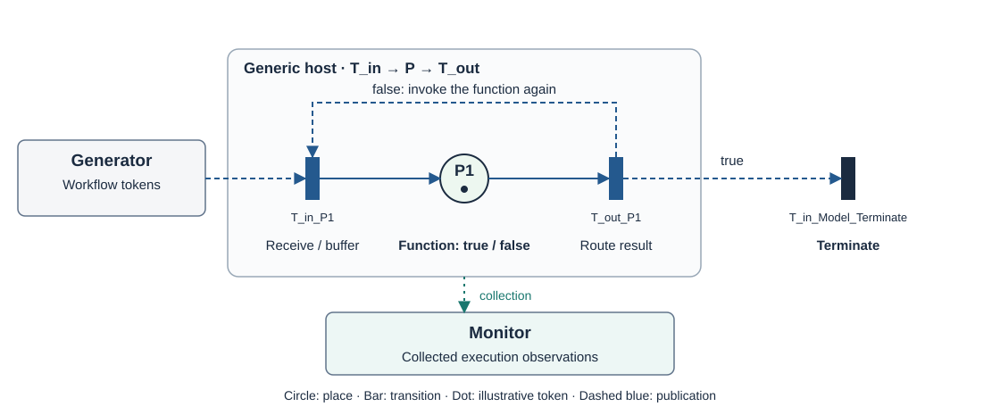
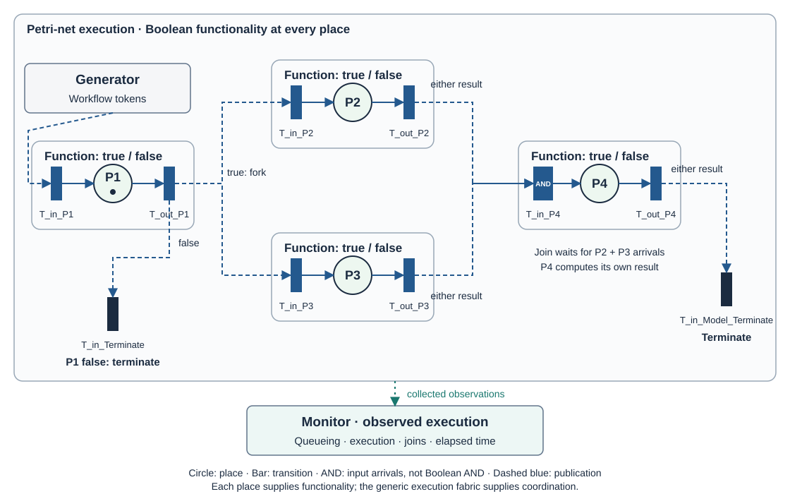
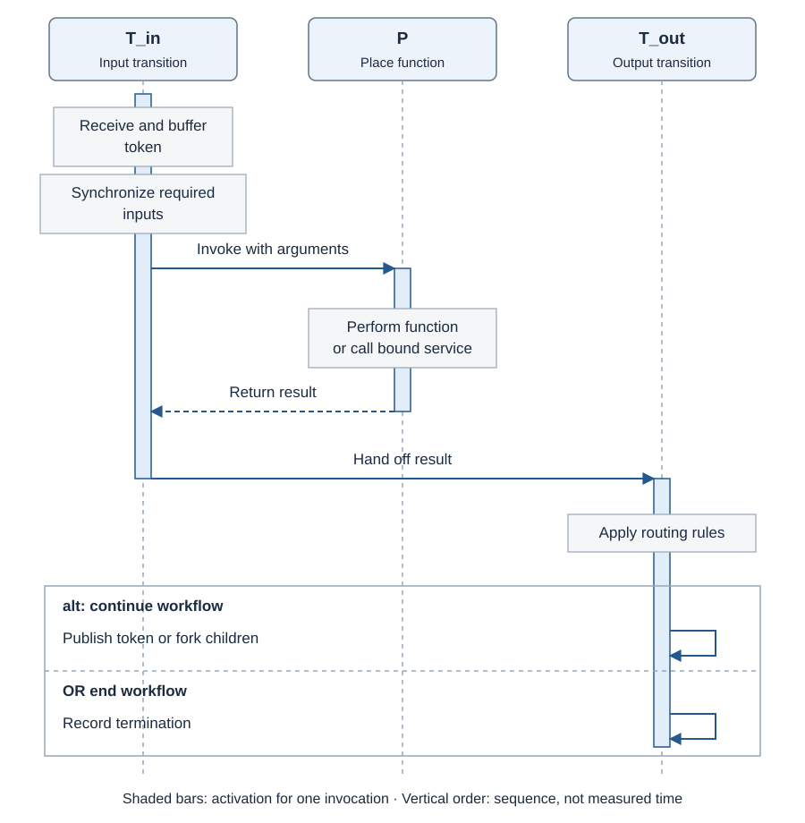

# Rule-Propagated Service Orchestration (RPSO)

**RPSO runs Petri nets as live distributed systems.** Each place is a real
service on a host, each transition is coordination logic installed as local
rules on that host, and tokens are messages that travel between hosts. The model
you draw in the editor is the process that executes, not a simulation of it.

Because the places are generic, the same orchestration runs any process you can
express as places, transitions, forks and joins: a Boolean Petri-net model, a
loan application or an emergency-department workflow. Bind different services to
the places and the process does different work. Change the deployment and the
same process runs across different machines. No central engine routes the
tokens; each host follows its own installed rules.

Every run is measured as it happens (queue waits, service times, join waits and
end-to-end workflow time) and can be replayed on the model. These are
measurements, not guarantees of meeting hard real-time deadlines.

Start with a Boolean-returning Petri-net example, then build towards the
financial and healthcare workflows. The repository also provides a workflow
editor, Ant build-and-run launchers, and observation/analysis tools.


*Draw the net, deploy its rules, run it as separate hosts. A place can be any service: a Boolean function, a credit check or a clinical diagnosis. The execution pattern inside each host is shown under [Architecture](#architecture-coordination-and-business-meaning).*

How each step is done, worked through for a single place in [Tutorial.md](Tutorial.md):

| Step | How | Walkthrough |
|---|---|---|
| **1 · Draw the model** | Place the elements, bind each place to a service and connect the transitions in ProcessEditor (`btsn.workflowEditor`) | [Design the process](Tutorial.md#1-design-the-process), [Deploy it](Tutorial.md#2-deploy-the-process) |
| **Deploy local rules** | One Ant launcher builds the JARs, starts the hosts and Monitor, then installs each host's rules and waits for its acknowledgement | [Rule deployment](#rule-deployment-and-token-execution) |
| **2 · Run as separate hosts** | The same launcher fires the tokens and collects the observations; each host routes them by its own rules | [Build and Run](Tutorial.md#3-create-build-and-run), [Run it](Tutorial.md#4-run-it), [Quick start](#quick-start-run-observe-and-replay) |
| **Analyse** | `PetriNetAnalyzer`, the timing chart and the spatial view read Monitor's data; ProcessEditor replays it on the model | [Show the results](Tutorial.md#5-show-the-results), [Observe a run](#observe-and-interpret-a-run) |

## Quick start: run, observe and replay

You need a JDK (15 or later; tested with 21) and Apache Ant 1.10. Eclipse is
optional: every launcher is an Ant build file that you can also run as an
**Ant Build** from Eclipse. The repository supplies the runtime libraries,
including OOjDREW and embedded Derby, so no Maven or Python is needed.

**1. Run a distributed workflow on one computer.** All launchers read node
addresses from
[`SingleHost.json`](btsn.common/InfrastructureDefinitionFolder/README.md), which
defaults to `192.168.1.82`. On any other machine, every place resolves as remote
and nothing starts, so pass the loopback address:

```sh
cd btsn.petrinet.ProjectLoader
ant -f P1_P2_P3_P4_Concurrent_BuildAndRun.xml -Dhost.address=127.0.0.1
```

This starts four place hosts and Monitor as separate processes, installs each
host's rules, fires two concurrent workflows (twenty tokens) through the
fork-and-join model below, and collects the measurements. The first lines of the
output should report each place as `local`. The hosts keep running after
collection; stop the launcher before starting another one.

**2. Analyse the run.** Save the analyzer's output so the editor can replay it.
Keep `-emacs`: it removes Ant's `[java]` line prefix, without which the editor
loads no events.

```sh
ant -emacs -f P1_P2_P3_P4_Concurrent_BuildAndRun.xml analyse > analysis.txt
```

**3. View the measurements.** `WorkflowSpatialView` (each token's visits, one
lane per place) and `SwingGanttChart_WithLatency_v1d` (workflow elapsed time and
queue waits) are Java applications in `btsn.common.Monitor`. In Eclipse, use
**Run As → Java Application**. From a shell, run them from `btsn.common.Monitor`
(use `;` instead of `:` on Windows):

```sh
java -cp "target/jar-runtime/btsn-monitor.jar:../btsn.common/target/host-runtime/btsn-infrastructure.jar:../btsn.common/lib/*" org.btsn.derby.Analysis.WorkflowSpatialView
```

**4. Replay it on the model.** Build and start the editor with
`ant -f btsn.workflowEditor/build.xml clean jar run`, open
`btsn.common/ProcessDefinitionFolder/petrinet/Workflow/P1_P2_P3_P4_Fork_Join_Workflow.json`,
load `analysis.txt` and press **Play**.

**5. Spread it across machines.** Give each node its machine's address in a
physical infrastructure definition, select it in the deployment profile, and
start each numbered place from its portable ZIP on its own machine. The
launcher then treats those places as remote and sends them rules and tokens
over the network. See [physical infrastructure](btsn.common/InfrastructureDefinitionFolder/README.md)
and [portable place releases](btsn.services/docs/PLACE_RELEASES.md).

The sections below explain what you have just run, starting from a single place
([Tutorial.md](Tutorial.md) walks through editing and running it).

## From the architecture pattern to a running service

Here is an example of how the components of the architecture pattern come
together to implement a live service workflow. A token arrives at an input
transition, the place invokes its bound service function, and an output
transition uses the result to continue or complete the process. The hosts in the
overview now become a running example.

We present the workflow as a **Petri net**: circular places identify the bound
functions, transition bars coordinate their execution, and arrows show the
possible routes taken by tokens. We begin with a single Boolean-returning
service, extend it into a parallel fork-and-join workflow, then give the same
architecture financial and healthcare functionality.

### One place: a function and its execution structure

We begin with one service so we can follow a token through a complete execution
unit. A decision to repeat or finish makes the relationship between input
receipt, function invocation and output routing visible in one small model.



In the [single-place tutorial](btsn.common/ProcessDefinitionFolder/petrinet/Workflow/P1_Tutorial_Workflow.json),
**P1 performs a function whose result is `true` or `false`**. The function produces
its own result; it does not simply copy the arriving token's logical state.
The transitions supply the execution behavior around that function:

| Model role | Execution responsibility | Tutorial behavior |
|---|---|---|
| **T_in** — input transition | Receive and buffer tokens; synchronize required inputs where a join is declared | Accept the initial token or a returning token |
| **P** — place with bound functionality | Invoke the selected operation with its declared inputs | P1 returns `true` or `false` |
| **T_out** — output transition | Apply routing rules; publish, fork or terminate | `true` ends the workflow; `false` returns to T_in_P1 |

Thus **T_in → P → T_out** maps to **receive/synchronize → invoke function →
route/publish**. A generic orchestration host implements the whole unit. The
place's function and the transitions' coordination responsibilities are separate.
Run [P1_Tutorial_BuildAndRun.xml](btsn.petrinet.ProjectLoader/P1_Tutorial_BuildAndRun.xml)
as an Ant Build; [Tutorial.md](Tutorial.md) explains editing and running it.

### Four places: Boolean functionality with a fork and join

With the pattern for one service established, we can connect several execution
units. This example introduces parallel branches and a join: the fabric must
deliver work to two functions and bring their results together before the next
function can run.



The [P1–P4 model](btsn.common/ProcessDefinitionFolder/petrinet/Workflow/P1_P2_P3_P4_Fork_Join_Workflow.json)
uses the same simple Boolean-returning functionality at **all four places**.
Each completed invocation produces its own `true` or `false` result, irrespective
of the arriving Boolean value. The model's routing rules determine whether that
result affects the next path:

| Place | Function result | What its surrounding transitions do |
|---|---|---|
| P1 | A fresh `true` or `false` | T_out forks to P2/P3 on `true`, or terminates on `false` |
| P2 | A fresh `true` or `false`, independent of P1's value | Forward either result to P4 through an unguarded publication |
| P3 | A fresh `true` or `false`, independent of P1's value | Forward either result to P4 through an unguarded publication |
| P4 | A fresh `true` or `false`, independent of the two input values | T_in waits for both P2/P3 arrivals; T_out forwards either result to final termination |

**The join synchronizes arrivals, not Boolean truth.** P4 does not require both
incoming values to be `true` and does not compute their Boolean AND. `AND` on the
input-transition bar denotes the required input arrivals. A result can be `false`
without preventing an unguarded onward publication.

Implementation detail: every place binds a separate deployment instance of the
same reusable function,
[`StochasticService.processToken`](btsn.common/src/org/btsn/services/StochasticService.java),
which returns a fresh random Boolean (probability of `true`: 0.5). The
[`boolean-token` adapter](btsn.common/src/org/btsn/invocation/BooleanTokenAdapter.java)
carries the incoming data and exposes that result to the process guards; it
never chooses a destination. The transitions receive inputs and route the
result according to the model.

Run [P1_P2_P3_P4_BuildAndRun.xml](btsn.petrinet.ProjectLoader/P1_P2_P3_P4_BuildAndRun.xml)
to execute this model. Its captured results appear under
[Petri-net fork/join execution](#petri-net-forkjoin-execution) below.

Circles are places; bars are transitions. Solid local arcs connect each
transition–place–transition unit. Dashed blue links represent publication between
units in executable RPSO notation; these transition-to-transition links are
separate from the arcs of an ordinary bipartite P/T net. Token dots are illustrative
markings, not measured execution snapshots. Monitor observes outside the token path.

### Give the same positions domain functionality

The first two models make coordination easy to follow by using simple Boolean
functions. We can now give the same positions a business purpose: bind functions
that accept domain data and return domain results, then declare their contracts
and routes. The following examples show what changes when those functions
perform financial or clinical work. Their business activity boxes abbreviate
the same **T_in → P → T_out** unit.

| Example | Functionality supplied at places | Coordination supplied by the fabric |
|---|---|---|
| Boolean Petri-net model | Produce `true` or `false` | Conditional routing, fork, buffering and input join |
| Financial application | Validate, check credit/fraud, underwrite and decide | Fork checks, synchronize their results and route declared outcomes |
| Emergency department | Triage, perform diagnostic operations, diagnose and treat | Select direct/diagnostic paths, fork diagnostics and synchronize results |

P1–Pn denotes the general model positions. This repository currently packages
six numbered host projects; deployment determines which functions they run.

### Financial loan application

A loan application gives the fork and join pattern a concrete business purpose.
Credit and fraud checks supply different information about the same application;
underwriting needs both results to decide how processing should continue.


Validation rejects invalid applications or forks into Credit Check and Fraud
Check. Underwriting joins their named results. `approved` and `conditional`
proceed to Decision; `declined` terminates early. See
[the Financial application guide](btsn.common/FinancialApplication.md) for contracts.

### Emergency department

A patient workflow adds a choice of paths and a larger set of required inputs.
This example shows how the same execution pattern supports a route selected by
triage and synchronizes several diagnostic results before the next function
runs.


Triage either publishes directly to Treatment or forks to Laboratory, Cardiology
and Radiology. Diagnosis waits for all three named results. Treatment accepts the
diagnosis path or the direct triage path through distinct operations, then ends
the patient workflow. See [the healthcare mapping](btsn.services/docs/HEALTHCARE.md)
for contracts and host assignments.

### Further topology: six places and two joins

The domain examples give the places business meaning. We can also extend the
coordination structure itself: this six-place model connects two joins, so the
result of one synchronized activity becomes an input to another.


The
[six-place double-join definition](btsn.common/ProcessDefinitionFolder/petrinet/Workflow/P1_to_P6_Double_Join_Workflow.json)
binds every place to its own deployment instance of the same Boolean function,
`StochasticService.processToken`. The adapter carries the incoming data, so the
branch data is preserved through both joins:

| Place | Input attributes | Output attribute | What its surrounding transitions do |
|---|---|---|---|
| P1 | `token` | `token` | T_out forks to P2/P3/P5 on `true`, or terminates on `false` |
| P2 | `token` | `token_branch2` | Publish either result to P4 |
| P3 | `token` | `token_branch1` | Publish either result to P4 |
| P4 | `token_branch1`, `token_branch2` | `token_branch2` | T_in waits for both P2/P3 arrivals; T_out publishes either result to P6 |
| P5 | `token` | `token_branch1` | Publish either result to P6 |
| P6 | `token_branch1`, `token_branch2` | `token` | T_in waits for both P4/P5 arrivals; T_out records workflow termination |

Only P1's result changes the route; the other places publish unconditionally.
The generic fabric performs the forks, input synchronization and publication.
P4 becomes eligible after both P2/P3 inputs are available, while P6 requires
P4/P5. The topology constrains causal order; the running hosts determine when
those steps actually execute.

Run
[P1_to_P6_Double_Join_Workflow.xml](btsn.petrinet.ProjectLoader/P1_to_P6_Double_Join_Workflow.xml)
as an Ant Build with its default target. It builds the JARs, prepares the selected
deployment, initializes, deploys, sends ten tokens and collects observations.
The launcher's `token.outcome` property is input data only; it does not force
P1's result. A smaller two-place example is
[P1_P2_BuildAndRun.xml](btsn.petrinet.ProjectLoader/P1_P2_BuildAndRun.xml).
See [the model guide](btsn.services/docs/PETRINET_MODELS.md) for profiles and contracts.

This is live token execution with measured queueing, local execution, join
waiting and workflow elapsed time. The services introduce no simulated
processing delays; launcher waits support startup and collection. Monitor
reconstructs the generated workflow families and the same analyzer, timing
chart and spatial view can inspect their observations. ProcessEditor can then
replay that captured execution on the topology.

These examples execute on the same generic host machinery. Their diagrams show
configured paths; the captured runs show measured execution.

## Architecture: coordination and business meaning

The examples have shown one execution pattern supporting different functions
and process structures. We can now look behind those models to see how the
platform assembles them. The diagram and table below locate the process
definition, service contract, deployment, execution machinery and observation
tools, and explain how their responsibilities fit together.


*Responsibility boundaries in the current Java implementation. Bound service
JARs are invoked in-process inside a numbered host. The dashed path configures
local rules; the dotted path carries collected observations outside the business
workflow.*

| Layer | Responsibility | Repository artefacts |
|---|---|---|
| Process model | Places, transitions, fork/join structure, guards and termination | `btsn.common/ProcessDefinitionFolder` |
| Service contract | Logical service identity, operations, named inputs and returned attribute | `BusinessServiceDefinitions`, `ServiceAttributeBindings` in `btsn.common` |
| Deployment | Map capabilities to implementation classes, hosts and channels | [Physical infrastructure](btsn.common/InfrastructureDefinitionFolder/README.md), [service deployments](btsn.common/ServiceDeploymentFolder/README.md) and `btsn.services/deployments/{healthcare,financial,models}` |
| Generic execution fabric | Transport, buffering, synchronization, version selection, invocation and publication | `btsn.rpso.places.p1`–`p6`, shared infrastructure |
| Business computation | Domain objects, calculations and decision symbols | `btsn.common/src/org/btsn/business`, packaged as independent service JARs |
| Observation | Collect records, reconstruct workflow families and display measurements | `btsn.common.Monitor` |

**Synchronize required inputs** means waiting for any remaining inputs after
the first token has been received and buffered. At a join, all declared inputs
must be available before P is invoked; for a single-input operation, that
requirement is immediately satisfied. T_in's activation ends after P's result
has returned and been handed to T_out. T_out's activation ends after routing
and publication, or after termination has been recorded. These are logical roles
within the host, which remains available for subsequent tokens.

A business service consumes its named inputs and returns a result. Where routing
is conditional, the result includes a symbol such as `approved` or `declined`.
The service interprets business meaning; the fabric matches the symbol against
declared routes and resolves the destination. Logical service identity is
separate from physical placement: P1 can host a clinical, financial or model
capability according to the selected deployment.



*The execution pattern within a generic host. T_in receives and synchronizes
inputs, P performs the bound functionality, and T_out routes the result. Shaded
activation bars show responsibility for one invocation; their lengths do not
represent measured time.*

The execution pattern is **T_in → P → T_out**:

- **T_in** receives and buffers inputs, accumulating the required named values
  for joins. Readiness also depends on version, validity and available capacity.
- **P** invokes the bound business operation under the local execution capacity.
- **T_out** applies the installed routing rules, publishes fork children or
  records a business termination.

These are semantic roles within the local execution machinery. The business
activity boxes abbreviate a complete **T_in → P → T_out** execution unit; the
Petri-net examples above expand their transition and place nodes explicitly.
The host implements the whole unit, with its bound operation giving P its
computational meaning.

There is no central engine making every runtime routing decision. Hosts use
local rule fragments and communicate through tokens. This does not imply absence
of distributed coordination, unlimited scalability, or a proven workflow
soundness property. Shared-host queues, transport and deployment remain relevant.

## Rule deployment and token execution

Those architectural responsibilities become operational when a model is
deployed to its hosts. Follow the path from the workflow definition and service
bindings to installed local rules, then to the tokens that activate the bound
functions. This connects the diagrams above to the steps performed by a
build-and-run launcher.


*Rule installation and runtime token flow are separate paths. Local installation
acknowledgements are not a global atomic-commit protocol.*

`TopologyBindingGenerator` derives operation bindings from the workflow.
`RuleDeployer` compiles/distributes versioned RuleML fragments to the participating
host operations and waits for local acknowledgements with retries in the normal
deployment path. Launchers that explicitly skip deployment require previously
installed matching rules. RuleBase version selection does not by itself pin the
business implementation binary; deploy the matching JARs and configuration too.

Runtime XML payloads carry token identity, workflow version, target operation,
named business attributes, validity and instrumentation fields. A fork creates
physical child tokens within one logical workflow family. Joins accumulate the
required inputs for that family; the analyzer uses recorded generated roots and
parent/child genealogy rather than treating every child as a new workflow.

| Component | Current role |
|---|---|
| `EventReactor` / `Scheduler` | Receive packets and maintain the local eligible-work ordering |
| `ServiceThread` | Validate the selected contract/version, coordinate inputs, invoke and publish |
| `RuleHandler` / OOjDREW | Install local RuleML and evaluate rule queries |
| `ServiceHelper` | Resolve and invoke the installed business implementation |
| `EventPublisher` | Send the resulting payload to the declared channel |

Priority applies to **waiting eligible work**. It does not interrupt a running
business operation. Different path lengths or different host operations can have
different queue waits without demonstrating priority overtaking. For controlled
same-queue evidence, run
[Queue_Priority_BuildAndRun.xml](btsn.healthcare.ProjectLoader/Queue_Priority_BuildAndRun.xml);
[its guide](btsn.healthcare.ProjectLoader/README.md#controlled-queue-priority-experiment)
explains the observed-backlog probe and its separate output files.

## Execution examples

Once the bindings and rules are installed, we can run the services and observe
how the configured paths execute. The following captures connect the earlier
models to measured workflow durations and queue waits on the Java execution
fabric. They retain the chart settings and measurements used when captured;
timing depends on the machine and run.

### Petri-net fork/join execution

Return to the four-place example and follow its ten generated workflow roots.
The chart groups each root with its fork children, letting us examine the
elapsed time of the complete workflow family and its largest observed visit
queue wait.


*A run of [P1_P2_P3_P4_BuildAndRun.xml](btsn.petrinet.ProjectLoader/P1_P2_P3_P4_BuildAndRun.xml).
Ten root workflows are shown in arrival order. Bars measure elapsed time from
generation to business completion; diamonds show the maximum observed
service-visit queue wait across each root's family, including fork children.
Children are reconstructed through genealogy, rather than drawn as extra root
workflows. The lane maximum in this run is 1,499 ms.*

### Financial service execution

This financial capture isolates the Validation function at P1. It lets us
inspect a domain service using the same measurements as the Boolean model,
before adding the remaining checks and decisions of the full loan workflow.


*A run of [FinancialSystem_P1_Simple_BuildAndRun.xml](btsn.financial.ProjectLoader/FinancialSystem_P1_Simple_BuildAndRun.xml),
the single-place Financial example. Ten application workflows are shown; lighter
lower shading marks the maximum observed visit queue wait. The lane maximum is
247 ms. This is the P1 example, not the full P1–P5 loan-application workflow.*

### Concurrent healthcare execution

The previous captures each show one workflow version. Here, several healthcare
processes run concurrently, bringing different routes and service demands into
the same observation view. Read the process labels and lane scales together to
understand which measurements can be compared directly.


*A captured viewport of the concurrent healthcare run. The three versions share
global arrival ranks, so a blank position in one lane can belong to another
version. Each lane uses its own measured maximum: 624, 1,014 and 5,329 ms.
The screenshot is clipped at the right edge; it is an excerpt, not a full-run
token count. Different routes and service loads also affect queue waits, so this
image alone does not establish priority overtaking at a shared queue.*

These captures precede the wider-bar menu and clearer measurement notes described
below. Their generic “queue-only observations” legend describes the glyph used
when queue wait is known but workflow elapsed time is unavailable; it does not
state that tokens have been excluded. New charts show this note only when such
observations are present. The Petri-net and Financial captures each visibly show
ten measured elapsed-time bars; run completeness should be checked against the
analyzer's generated-root and completion counts.

## Observe and interpret a run

The captures provide a visual overview. To assess a run, connect those pictures
back to the recorded roots, service visits and completion events. The tools below
let us check whether the workflows completed, trace where they spent time and
replay their observed paths on the model.

Monitor is an **observation service outside the active business-token path**.
An explicit business `TerminateNode` defines completion in the migrated workflows;
collector arrival at Monitor is a separate observation boundary. Initializer and
collector commands are administration traffic, normally using v999.

The tools in `btsn.common.Monitor/src/org/btsn/derby/Analysis` include:

| Tool | Use |
|---|---|
| `PetriNetAnalyzer` | Generated roots, fork genealogy, join consumption, canonical place visits, completion and structural/temporal checks |
| `SwingGanttChart_WithLatency_v1d` | Workflow elapsed/queue figure, measured timeline, service queue comparisons, and publication exports |
| `WorkflowSpatialView` | Each token's visits over time, one lane per place, labelled with its service and node |

The combined chart offers **Diamonds** and **Lower Queue Shading** from
**View → Queue Display**. The bar shows measured workflow elapsed time; the marker
or lighter lower portion shows the **maximum observed service-visit queue wait**
across that workflow family. This is an independent measurement, not total
workflow waiting or an additive decomposition into waiting and service time.

**View → Y-Axis Scale → Scale Each Version** is the default: each version lane
scales to its maximum measured workflow duration. Select **Shared Milliseconds**
to compare absolute durations by bar height across versions. **Workflow arrival
rank** on the x-axis counts roots in generation order across all versions;
equal spacing does not mean equal time between arrivals. Time is measured on
the y-axis, in milliseconds; bar width does not encode duration. Missing
observations remain unavailable rather than being plotted as measured zero.

**View → Bar Width → Wide (Publication)** is the default for a fuller figure,
closer to the earlier presentation. Select **Narrow** for the thinner bars.
Both choices preserve arrival positions, measured heights, lane scales and
lower queue shading, and apply to PNG, PDF and TikZ exports. The footer reports
how many observed roots the selected **Display Range** shows. This count describes
the plotted data; a narrow viewport may still require horizontal scrolling.
A dashed queue outline means the wait is known but the elapsed interval is
unavailable; the chart retains that root without inventing a completion time.
For a full figure rather than a viewport screenshot, select **Display Range →
Show All**, then use **File → Export Chart to PNG** or the PDF/TikZ export.

New runs capture their process definitions in
`btsn.common.Monitor/WorkflowRunMetadata`; charts and exports display that context.
Keep this metadata with `ServiceAnalysisDataBase` when archiving results. Older
runs without matching metadata show `Process not captured`.

To animate observations, run `com.editor.ProcessEditor` from
[btsn.workflowEditor](btsn.workflowEditor/src/com/editor/ProcessEditor.java)
(or `ant -f btsn.workflowEditor/build.xml clean jar run`), open the matching
workflow JSON, load the analyzer output saved with `ant -emacs … analyse >
analysis.txt`, then press **Play**. This replays captured observations; it does
not launch the distributed workflow.
Open the workflow from its place under `btsn.common/ProcessDefinitionFolder` so
that its service deployment loads. The analyzer names places and transitions
after their hosting node (`P1_Place`, `T_in_P1`), and the deployment maps those
nodes to the labels on the canvas, such as `NS_Green` in the traffic-light model.

## Project layout and build support

We have followed a model from its service bindings through execution and
analysis. The project map below shows where to find each part when working with
the repository: the definitions to edit, the implementations to package, the
launchers to run and the tools to inspect the results. The build commands then
provide entry points for preparing the packaged runtime.

| Project | Purpose |
|---|---|
| `btsn.common` | Shared source, business implementations, contracts, physical infrastructure, service deployments, process definitions and rules |
| `btsn.services` | Service packaging, shared Ant builds, deployment profiles and checks |
| `btsn.rpso.places.p1`–`p6` | Generic numbered orchestration hosts |
| `btsn.common.Monitor` | Collection, reconstruction and visualization |
| `btsn.common.eventgenerators` | Shared workflow and administration generators |
| `btsn.healthcare.ProjectLoader` | Healthcare launchers and process tests |
| `btsn.financial.ProjectLoader` | Financial launchers |
| `btsn.petrinet.ProjectLoader` | Petri-net model launchers and utility phases |
| `btsn.workflowEditor` | Model editor and observation animator |

All domains share the physical network and fixed ports in
[`InfrastructureDefinitionFolder`](btsn.common/InfrastructureDefinitionFolder/README.md).
Business operations are assigned to those nodes in
[`ServiceDeploymentFolder`](btsn.common/ServiceDeploymentFolder/README.md).
Their routing and guards belong in
[`ProcessDefinitionFolder`](btsn.common/ProcessDefinitionFolder); the analysis
folders hold observations from executing those models.

`btsn.services` contains build support, not business implementation or execution
handlers. Service JARs are grouped under
`btsn.services/target/deployment/services/{healthcare,financial,models}`; support
libraries accompany them under `target/deployment/lib`. Host placement is selected
separately by deployment metadata. Eclipse `bin` outputs are not inputs to the
packaged workflow runtime. Runtime databases, installed rule copies, run metadata
and chart exports are local outputs excluded from Git.

For packaging/checks without starting a workflow:

```sh
ant -f btsn.services/build.xml check
```

For a portable numbered-host JAR and ZIP:

```sh
ant -f btsn.rpso.places.p1/build.xml
```

See [shared build support](btsn.services/README.md),
[portable releases](btsn.services/docs/PLACE_RELEASES.md), and
[Petri-net model profiles](btsn.services/docs/PETRINET_MODELS.md).

The current diagrams are editable SVGs. Their source models, conventions and
regeneration command are documented in [images/README.md](images/README.md).

## License

The licensing terms for the software and accompanying documentation follow.

**Copyright (c) 2025 Alexander Cameron**

Permission is hereby granted, free of charge, to any person obtaining a copy of this software and associated documentation files (the "Software"), to use, copy, modify, merge, and distribute the Software for non-commercial purposes, subject to the following conditions: the above copyright notice and this permission notice shall be included in all copies or substantial portions of the Software.

**Commons Clause Restriction:** The grant of rights under this license does not include the right to Sell the Software. "Sell" means providing the Software, or any derivative work, to third parties for a fee or other consideration, or offering a product or service whose value derives substantially from the Software's functionality. For commercial licensing enquiries, contact [your email].

THE SOFTWARE IS PROVIDED "AS IS", WITHOUT WARRANTY OF ANY KIND, EXPRESS OR IMPLIED.

## Author

Alexander Cameron
