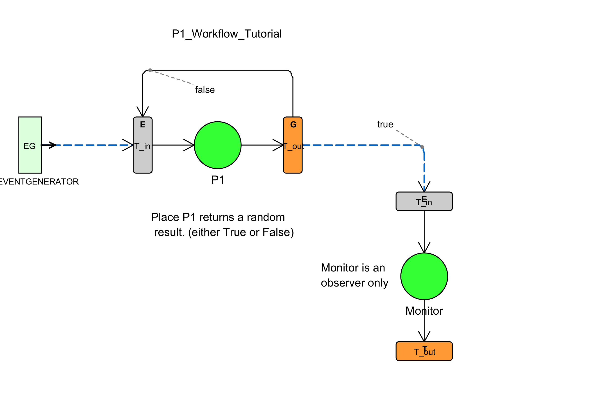

# Tutorial for Building a Simple Workflow

Assuming that you have read the readme file, and have loaded the projects into either Eclipse or your favourite IDE, then here a short tutorial that you can use to build your first process using process editor.  

## Edit the Workflow with the ProcessEditor

First, begin by running the process editor which can be found in the project  `btsn.WorkflowEditor/com/editor/ProcessEditor`.  Then from the `File` menu, load the tutorial workflow definition from `btsn.common/ProcessDefinitionFolder/petrinet/workflow/P1_Tutorial_Workflow.json`.  It should look like the workflow depicted in Figure 1.

  

*Figure 1. Tutorial of a Single Service process*

We are using the PetriNet process type as the methods and attributes are very simple and reflect typical petri net architecture model.  The process comprises an Event Generator that generates the payload a single service node and a monitor service.

Note don't be confused with the Monitor Service - it is not part of the process but acts as an observer only.   It is not normally needed as generally a process just goes to a  `Terminate Node` but we are using it here to capture the tokens as they arrive so we can gain an understanding of their arrival distribution.

If you click on the *T_in_P1* node you will see the type of node it represents (i this case it is an `Edge Node`, but could be a Merge or Join type).  An Edge Node is the simplest type and reflects a standard UDP port. 

If you now click on the Service (or place) node you will see that the Service name is `P1_Place` and has a single method `processToken`, and if you click on the argument type you will see that it accepts the argument `token` which is of type `String`.  Because it is a simple Petri Net service, it just returns `true` or `false` with equal probability.

If you now click on the *T_out_P1*  node you will see that it is a node type `Gateway Node` and thus has publishing guards associated with it.  These guards can be set by clicking on the outgoing edges or arrows.  The process requires the `token` to be true, thus if it the service returns a `false` value it is routed back to the *T_in_P1* to try again.  That's it - however if you have changed anything you will need to save the changes.

## Build and Deploy the Workflow
We now have the process defined, so we now need to build and deploy the infrastructure components and the RuleBase so that when the infrastrucutre receives a payload belonging to say `RuleBase V001` it will know what to do with it.  

We build, load and deploy the process by running the Ant build located in the `btsn.petrinet.ProjectLoader/P1_Tutorial_BuildAndRun.xml`
### What is Happening during the build?

1. All the infrastructure handlers are compiled and loaded by the `serviceLoader` class and the UDP listener threads created.

2. The process definition (figure 1) is now parsed by a two utilities classes called `TopologyBindingGenerator.java` and `RuleDeployer.java`.  Their pupose is to extract all the bindings from the `json` topology and to verify that it matches the Service Definitions and to then Deploy calls the `RuleHandler` with the RuleBase configuration.   If successful, the `ruleHandler` will commit to the process.

During the build the Event Generator will be told the name of the target service and the method to be called.   In this case it is simpl the tWhen the payload arrives at the control node (*T_in_P1*) it will be checked to see if it is a valid payload and that the RuleBase value matches any of the ruleBases that the service has committed to. If there is a match, and the canonical bindings also match then the service is invoked.  In the case the service returns a false value then the routing (*T_out_P1*) calls the service again and will keep doing this until the result is true.

You will notice that *T_out_P1* is a `Gateway Node` and so each of the arrows leaving *T_out_P1* have `guard` expressions that determine their behaviour.

1.  Load the tutorial workflow definition from `btsn.common/ProcessDefinitionFolder/petrinet/workflow/P1_Tutorial_Workflow.json`.  It should look like the workflow depicted in Figure 1.
2.  To run the architecture against this process model, select and run the Ant build file `btsn.petrinet.ProjectLoader/P1_Tutorial_BuildAndRun.xml`

## Tutorial: Running the Healthcare Workflow

If you would just like to run an existing animation you do not need to build and run the process, you can just go straight to step 5.

### Running the Emergency_Department_Patient_Workflow

1. Expand project `btsn.petrinet.ProjectLoader`

2. Run the Ant build file `P1_Tutorial_BuildAndRun`

3. When complete, open project `btsn.common.Monitor`, then open `org.btsn.derby.Analysis` and run `PetriNetAnalyzer` to confirm the analysis was captured and valid

4. Copy the analysis results to: `btsn.common/AnalysisFolder/Healthcare/Emergency_Department_Patient_Workflow.txt`

### Animating a Process

5. To run the animator, open `btsn.WorkflowEditor/com/editor/ProcessEditor`

6. Now we need to load the workflow definition file in the process editor.  Open the workflow definition folder `ProcessDefinitionFolder/healthcare/Workflow` in `btsn.common` and navigate to select the process: `Emergency_Department_Patient_Workflow.json`

7. Load the analysis file from the Analysis, e.g. `btsn.common/AnalysisFolder/Healthcare/Emergency_Department_Patient_Workflow.txt`

8. Press **Play** to see the simulation results

## Author

Alexander Cameron
