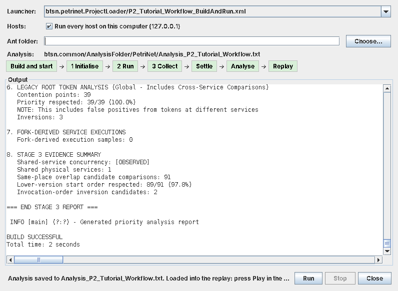
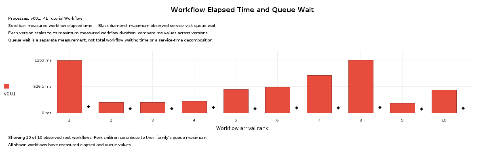

# Tutorial: design, deploy, build and run a process

This tutorial takes one process from an empty canvas to a replayed run, all
from ProcessEditor:

- **Design**: a single place P2 calls `StochasticService.processToken`, which
  returns `true` or `false` at random.
- **Routing**: `true` terminates the workflow and `false` sends the same token
  back to P2.
- **Observation**: Monitor records every step from outside the token path.


*The P2 tutorial process. P2 is selected. The badge on the place and the **Runs
on** box show the node it is deployed to.*

| Step | What you do | Where |
|---|---|---|
| **1. Design the process** | Draw the net, choose the service and operation for P2, set the guards, then save | [Design](#1-design-the-process) |
| **2. Deploy the process** | Choose the node P2 runs on, then save the service deployment | [Deploy](#2-deploy-the-process) |
| **3. Create Build and Run** | Choose the event generators and the number of tokens; the editor writes the Ant launcher | [Build and Run](#3-create-build-and-run) |
| **4. Run it** | Click **Run**: the editor runs the launcher, analyses the run and loads the replay | [Run](#4-run-it) |
| **5. Show the results** | Analyse the run, view the charts and replay the tokens on the design | [Results](#5-show-the-results) |

Finished copies of every file are included as `P2_Tutorial_*` ([list](#repository-artefacts)):

- To follow along, save your own files as `My_P2_Workflow`. That keeps the
  supplied files for comparison.
- Every path below starts at the repository root.

## Before you start

- **Tools**:
  - **JDK 15 or later** and **Apache Ant 1.10.2 or later**. Run Ant with a JDK so its compiler is available.
  - In Eclipse, import the projects with **File → Import → General → Existing
    Projects into Workspace**, leaving **Copy projects into workspace** unchecked.
  - You need `btsn.common`, `btsn.services`, `btsn.common.eventgenerators`,
    `btsn.common.Monitor`, `btsn.petrinet.ProjectLoader`, `btsn.workflowEditor`
    and `btsn.rpso.places.p1`–`p6`.
- **Start the editor**:
  - Run [`com.editor.ProcessEditor`](btsn.workflowEditor/src/com/editor/ProcessEditor.java)
    as a Java application with **btsn.workflowEditor** as its working directory (Eclipse's default).
  - The Deploy panel finds the shared infrastructure from there.
- **Know what a run resets**: every run reinitialises the P2 and Monitor
  databases. Save any results you want to keep before running again.

## 1. Design the process

Choose **File → New → Process Definition** and set the toolbar's **Type** to
**PetriNet**.

### Place the elements

Select a palette tool, click the canvas, then fill in the **Attributes** panel.
Set **Transition Type** before **Node Type**; **Node Value** follows automatically.

| Palette tool | Label | Attributes |
|---|---|---|
| Event Generator | `EG11` | Rate (ms): `1000`; Version: `v001` |
| Transition | `T_in_P2` | Transition Type: `T_in`; Node Type: `EdgeNode`; Buffer: `10` |
| Place | `P2` | Service: `StochasticService`; Operation: `processToken` (see below) |
| Transition | `T_out_P2` | Transition Type: `T_out`; Node Type: `GatewayNode` |
| Transition | `Terminate` | Transition Type: `Other`; Node Type: `TerminateNode` |

- Labels must be unique.
- Name each place's transitions after that place: either its label or the node it is deployed to.
  - Use the same name on the T_in and the T_out.
  - Here both are `P2`, so `T_in_P2` and `T_out_P2`. If you relabel the place `TRUEORFALSE` and deploy it to P2, then `T_in_P2` or `T_in_TRUEORFALSE` both pass.
  - Business models use the label, for example `T_in_Validation`.
- The generator's **Rate** and **Version** become the defaults in
  [Build and Run](#3-create-build-and-run).
- The supplied `P2_Tutorial_Workflow.json` stores `T_out_P2` as a `DecisionNode`. The runtime accepts it too, and both route on the guards below.

### Choose the service and operation

Select P2. Its Attributes panel works from the **service catalogue**: the list
of services and their operations that the hosts can run.

1. **Catalogue**: the panel names the catalogue in use. If the **Service** list is empty, click **Choose catalogue...** and open
   [`BusinessServiceDefinitions/petrinet/PetriNetModels.json`](btsn.common/BusinessServiceDefinitions/petrinet/PetriNetModels.json).
   Once the process is saved under `ProcessDefinitionFolder/petrinet`, the editor selects this catalogue itself.
2. **Service**: hover over each entry in the list to see what it does. Choose `StochasticService`. Its only operation, `processToken`, is
   selected for you.
3. **What it does**: the box under the Operation says what the service does and what it returns, so you know how to route its result:

   > Decides at random: returns true or false with equal chance. Use it to model a step that sometimes has to be repeated, such as a check that can fail.<br>
   > Returns: true or false. Route on it from the T_out with guards true and false.

4. **Contract**: the box shows `processToken(token) → token`. The catalogue
   supplies the arguments; you do not type them.
5. **Runs on**: the box reads **Not deployed yet**. Where P2 runs is decided in [step 2](#2-deploy-the-process).

Choosing a service does not create one. `StochasticService` is already packaged
([source](btsn.common/src/org/btsn/services/StochasticService.java)) and runs
inside the generic host on whichever node you deploy P2 to.

The descriptions come from the catalogue, where each service has a
`description` and a `returns` entry. The Deploy panel shows the same text when you hover over a Service or Operation cell. When you add a service to a catalogue, describe it there as well; the editor checks require both entries.

### Connect the elements and set the guards

Use **Arrow (drag)**, or **Arrow (click waypoints)** to bend the return route.

| Source | Target | Arrow label | Guard Condition | Decision Value |
|---|---|---|---|---|
| `EG11` | `T_in_P2` | | | |
| `T_in_P2` | `P2` | | | |
| `P2` | `T_out_P2` | | | |
| `T_out_P2` | `Terminate` | `true` | `DECISION_EQUAL_TO` | `true` |
| `T_out_P2` | `T_in_P2` | `false` | `DECISION_EQUAL_TO` | `false` |

- **The label is only a caption.** Guard Condition and Decision Value define the route.
- Leave **Endpoint** blank.
- How a token moves:
  - T_in receives and buffers the token.
  - P2 invokes `processToken`.
  - T_out routes on the result: `false` repeats the visit with the same token, and `true` completes the workflow.
- `StochasticService` returns `true` with probability 0.5, so on average each workflow visits P2 twice.

### Validate and save

1. Click **Validate**. Fix any missing labels, incomplete operations or invalid connections.
2. Choose **File → Save Process Definition As...** and save to
   `btsn.common/ProcessDefinitionFolder/petrinet/Workflow/My_P2_Workflow.json`.

The process must be saved under `ProcessDefinitionFolder/<domain>/`:

- The domain folder (`petrinet`) selects the catalogue, the deployment folder
  and the launcher folder used in the next steps.
- Until it is deployed, the saved file records only its catalogue (`"catalog"`).

## 2. Deploy the process

Deploying decides which **node** (physical host) each place runs on. Each node is one numbered generic host, P1 to P6.

### Choose the node

Use either route:

- **Right-click P2 → Deploy to → P2**: the quick route for a single place.
  - The place shows a dashed **P2** badge, and **Runs on** says *(not saved; use Deploy)*.
  - Use **Deploy panel...** on the same menu to open the panel described next.
- **Click Deploy** in the toolbar: opens the Deploy panel beside the editor, already filled from the process.


*The Deploy panel. There is one row per place, and you choose the Node. The other columns are filled for you.*

| Column | Filled with | You change it when |
|---|---|---|
| **Place** | The place label on the canvas | Never; it ties the row to the canvas |
| **Node** | Your right-click choice, or the first free node | You want the place on another host. Edit the cell; the canvas badge follows. |
| **Service / Operation / Return Attribute** | The place's contract from the catalogue | Never; change the design instead |
| **Port Slot** | `0`, the node's first fixed port | A node has a second port (P4, P6) and you need it |
| **Instance** | The place label (`P2`) | You want another name. The supplied file uses `StochasticInstance1`. |
| **Invocation Adapter** | `boolean-token` for a Boolean service | Never for this tutorial |

The **Physical node network** table at the top is read-only. It comes from
[`SingleHost.json`](btsn.common/InfrastructureDefinitionFolder/SingleHost.json):

| Node | Channel | Address | Fixed Base Ports |
|---|---|---|---|
| `P1` | `ip0` | `192.168.1.82` | `4001` |
| `P2` | `ip0` | `192.168.1.82` | `4002` |
| `P3` | `ip0` | `192.168.1.82` | `4003` |
| `P4` | `ip0` | `192.168.1.82` | `4004, 4007` |
| `P5` | `ip0` | `192.168.1.82` | `4005` |
| `P6` | `ip0` | `192.168.1.82` | `4006, 4008` |

- To change the nodes themselves, choose **File → Open → Infrastructure Definition...**.
- For a run on one computer you do not need to edit the address; [step 4](#4-run-it) overrides it.

### Save the deployment, then the process

1. In the panel, click **Save deployment...**. It suggests
   `btsn.common/ServiceDeploymentFolder/petrinet/My_P2_Workflow.json`; accept it.
2. The process now links to that deployment (`"serviceDeployment"`) and P2 takes its instance.
   - The badge turns solid.
   - **Runs on** reads `P2 — 192.168.1.82:4002`.
3. Save the process again with **File → Save Process Definition**.

The saved files link to one another:

- process → service deployment (`serviceDeployment`)
- service deployment → catalogue (`catalog`)

To see where any place runs, open the process and select the place. Bindings and
network rules are generated by the launcher when it runs; there is nothing else
to generate here.

## 3. Create Build and Run

Click **Build and Run** in the toolbar. The editor first checks that:

- the process and its deployment are both saved;
- every place is deployed on one of P1–P6;
- an event generator feeds a deployed place through a `T_in` transition.

It lists anything missing. Healthcare processes use their own token generator
and are not supported here yet.


*Create Build and Run, shown for the P2 tutorial with a second generator, EG6, at v002. The summary marks each file as Write, Reuse or Replace before anything is written.*

| Choice | Default | Meaning |
|---|---|---|
| **Tokens per generator** | `10` | Root workflows each generator starts |
| **Wait after last token (s)** | `10` | Time for the last workflows to finish before collection |
| **Launcher name** | `<process>_BuildAndRun.xml` | File name of the launcher |
| **Folder** | `btsn.<domain>.ProjectLoader` | Where the launcher is written |

The **Event generators** table has one row per generator in the process:

| Column | Default | Meaning |
|---|---|---|
| **Run** | Ticked | Untick a generator to leave it out of this launcher |
| **Feeds** | From the design | The runtime place and operation the generator's tokens go to |
| **Version** | The generator's Version | Rule version for its tokens (`v001`–`v003`) |
| **Interval (ms)** | The generator's Rate | Spacing of its token schedule |

With more than one generator:

- **They all fire together.** Their workflows share the places and compete for them.
- **Each needs its own version.** The version keeps their tokens apart, so Create stays disabled until no two ticked generators share one.
- **The analysis separates them.** It reports each version on its own, and the replay shows all of them.

Click **Create**. For `My_P2_Workflow` the editor writes:

| File | Role |
|---|---|
| `btsn.petrinet.ProjectLoader/My_P2_Workflow_BuildAndRun.xml` | The launcher: your choices as properties, plus an import of the shared run phases |
| `btsn.services/deployments/models/My_P2_WorkflowDeployment.json` | Deployment profile: catalogue, infrastructure and your service deployment. An existing profile for the same deployment is reused. |
| `btsn.common.eventgenerators/EventTriggeringFile/My_P2_Workflow_BuildAndRun.csv` | Token schedule, one `time_ms,0,1` row per token. With several generators, each gets its own file, named after it (for example `..._BuildAndRun_EG6.csv`). |
| `ProcessDefinitionFolder/common/Initializers/P2_Initialization.json` | Resets the hosts and Monitor. Reused when it exists; written for a new set of nodes (for example `P3_P5_Initialization`). |
| `ProcessDefinitionFolder/common/Collectors/P2_Collector.json` | Collects the observations into Monitor. Reused or written the same way. |

- The launcher is about 25 lines; the supplied [`P2_Tutorial_Workflow_BuildAndRun.xml`](btsn.petrinet.ProjectLoader/P2_Tutorial_Workflow_BuildAndRun.xml) is an example.
- The run phases live in
  [`btsn.services/process-runtime.xml`](btsn.services/process-runtime.xml).
- To change a choice, run **Build and Run** again rather than editing the
  launcher. A command-line override also works for a single run ([step 4](#4-run-it)).

## 4. Run it

### Run from the editor

Click **Run** in the toolbar. The Run window finds the process's launcher and does the whole run:

1. **Builds and starts** the hosts, then follows the launcher through its three phases.
2. **Settles and stops.** When collection is done, it waits for Monitor to finish writing, then stops the launcher and every host it started.
3. **Analyses.** It runs `analyse` and saves the report to `btsn.common/AnalysisFolder/PetriNet/Analysis_My_P2_Workflow.txt`, replacing any earlier analysis of the process.
4. **Loads the replay.** It loads the analysis into the editor, so you can press **Play** straight away ([step 5](#replay-the-tokens-on-the-design)).



*A finished run of the P2 tutorial (here with its two generators). Each step turns green as the run reaches it.*

- **Hosts**: **Run every host on this computer** (ticked) adds `-Dhost.address=127.0.0.1`.
- **Ant**: the editor calls Apache Ant.
  - Leave the field blank to use `ANT_HOME` or `ant` on the PATH.
  - Otherwise choose the `ant` program (`ant.bat` on Windows) in Ant's `bin` folder.
  - Eclipse includes one under `plugins/org.apache.ant_*/bin`.
- **Stop**: stops the run, and its hosts, at any point.
- **Close**: closing the window during a run stops it too.
- **Save first**: Run uses the saved process and the launcher from [step 3](#3-create-build-and-run).

### Or run the launcher yourself

- **In Eclipse**: refresh `btsn.petrinet.ProjectLoader`, right-click
  **My_P2_Workflow_BuildAndRun.xml**, then choose **Run As → Ant Build**.
- **From a terminal**:

  ```sh
  ant -f btsn.petrinet.ProjectLoader/My_P2_Workflow_BuildAndRun.xml -Dhost.address=127.0.0.1
  ```

- **On one computer**: `-Dhost.address=127.0.0.1` runs every host on this machine. In Eclipse, put it under
  **Run As → Ant Build... → Main → Arguments**. Without it, a host starts locally only when its `SingleHost.json` address belongs to this computer.

The default target `run-complete-workflow` does everything:

- builds the JARs;
- prepares an isolated runtime under `btsn.services/target/launchers/My_P2_Workflow_BuildAndRun`;
- starts P2 and Monitor;
- runs the three phases.

| Phase | What happens | Definition used |
|---|---|---|
| 1 — Database initialization | Reset P2 and Monitor (administrative version `v999`) | `common/Initializers/P2_Initialization` |
| 2 — Workflow execution | Generate the rules for P2, deploy the process as `v001`, then fire the tokens from EG11 | `petrinet/Workflow/My_P2_Workflow` |
| 3 — Data collection | Request P2's observations and write them to Monitor | `common/Collectors/P2_Collector` |

### Stop it when collection finishes

The console ends with `... COMPLETED SUCCESSFULLY` and
`Services are still running. Press Ctrl+C to stop.`

1. Allow Monitor a few seconds to finish writing.
2. Stop the run with Eclipse's red **Terminate** button, or **Ctrl+C** in the terminal. This releases the Monitor database for the analyser and viewers.

Host logs go to `P2_Place.out.txt` and `MonitorService.out.txt` beside the
launcher. The collected data is in `btsn.common.Monitor/ServiceAnalysisDataBase`.

### Change a run without regenerating

| Override | Effect |
|---|---|
| `-Dtoken.count=5` | Fire only the first 5 tokens of the schedule. To fire more than it holds, recreate the launcher with a larger number. |
| `-Dworkflow.completion.seconds=30` | Wait longer after the last token before collecting |
| `-Dhost.address=127.0.0.1` | Run every host on this machine |
| `-Dp2.mode=local` or `remote` | Force a host to start here, or expect it elsewhere |

`ant -f <launcher> help` lists these.

## 5. Show the results

### Analyse the run

After stopping the run:

```sh
ant -emacs -f btsn.petrinet.ProjectLoader/My_P2_Workflow_BuildAndRun.xml analyse > btsn.common/AnalysisFolder/PetriNet/Analysis_My_P2_Workflow.txt
```

- **In Eclipse**: run the launcher's **analyse** target and copy the console
  into that file.
- **Ant's `[java]` prefixes**: they are fine. The editor's replay accepts them.
- **Several analyses in one file**: if you append analyses to the same file, replay uses the last one.

Check the report's first section, **CANONICAL WORKFLOW RECONSTRUCTION**:

- `Generated workflows` and `Completed workflows` should both equal the number
  of tokens.
- `Structural result: [OK]`.
- There should be no forks or joins.

Count workflows separately from place visits:

- Each `false` result makes the same workflow visit P2 again.
- So there are usually more visits than workflows.
- Administrative `v999` activity is reported separately.

The supplied run ([analysis](btsn.common/AnalysisFolder/PetriNet/Analysis_P2_Tutorial_Workflow.txt)) gives:

| Measure | Value |
|---|---|
| Generated / completed workflows | 10 / 10 |
| P2 visits (5 repeats after `false`) | 15 |
| End-to-end latency | 152 to 885 ms, median 260 ms |
| Token inter-arrival | 1,000 ms (from the schedule) |

Boolean outcomes, repeat counts and timings vary from run to run.

### Replay the tokens on the design

1. Open `My_P2_Workflow.json` in ProcessEditor.
2. Click **Load Analysis...** and choose `Analysis_My_P2_Workflow.txt`.
3. Use **Play**, the step buttons and **Speed**.
   - Each token enters at EG11 and is held at P2 while the service runs.
   - It returns along `false`, or leaves along `true` to **Terminate**.

Use the process that produced the run: the replay matches log entries to the places on the canvas. Replaying does not deploy or rerun anything.

### Timing chart and spatial view

Run these from `btsn.common.Monitor`, with that project as the working directory:

| Viewer | What it shows |
|---|---|
| `org.btsn.derby.Analysis.SwingGanttChart_WithLatency_v1d` | Elapsed time per workflow, with the longest queue wait observed on a service visit |
| `org.btsn.derby.Analysis.WorkflowSpatialView` | Activity at each place over time, including repeat visits |



*Elapsed time per workflow from the [captured P1 reference run](docs/tutorials/p1/results/README.md), the same loop on node P1:*

- *Bars run from generation to completion.*
- *Black diamonds mark the longest queue wait on a single service visit, not the total across the loop.*

That reference run has its own launcher and export target. It writes the
analysis, per-workflow CSV and charts to `btsn.services/target/tutorial-results/P1`:

```sh
ant -f btsn.petrinet.ProjectLoader/P1_Tutorial_Local_BuildAndRun.xml
ant -f btsn.petrinet.ProjectLoader/P1_Tutorial_Local_BuildAndRun.xml export-tutorial-results
```

### If your results differ

| Observation | Check |
|---|---|
| Build and Run lists problems | Save the process and the deployment; deploy every place on P1–P6, each on its own node; connect the generator to a `T_in` |
| The Deploy panel's node table is empty | Start ProcessEditor with `btsn.workflowEditor` as its working directory |
| A host or Monitor was skipped at startup | Add `-Dhost.address=127.0.0.1`, or start that host on its configured machine |
| Derby reports another active instance | Stop the previous run, and any viewer holding the database, before analysing |
| Fewer completed workflows than generated | Wait longer before collecting: `-Dworkflow.completion.seconds=30`, or raise **Wait after last token** and recreate the launcher |
| Replay shows no tokens, or tokens skip a place | Load the analysis with the process that produced it, and check it is that run's file |
| A design change did not run | Save the process. If you changed places, redeploy and save the deployment first. |

## Repository artefacts

The supplied P2 tutorial, built with exactly these steps:

| Artefact | Role |
|---|---|
| [P2_Tutorial_Workflow.json](btsn.common/ProcessDefinitionFolder/petrinet/Workflow/P2_Tutorial_Workflow.json) | Process design, linked to its deployment |
| [P2_Tutorial.json](btsn.common/ServiceDeploymentFolder/petrinet/P2_Tutorial.json) | Service deployment: P2 on node P2, linked to its catalogue |
| [PetriNetModels.json](btsn.common/BusinessServiceDefinitions/petrinet/PetriNetModels.json) | Petri-net service catalogue (`StochasticService`) |
| [SingleHost.json](btsn.common/InfrastructureDefinitionFolder/SingleHost.json) | Shared nodes P1–P6, addresses and fixed ports |
| [P2_Tutorial_WorkflowDeployment.json](btsn.services/deployments/models/P2_Tutorial_WorkflowDeployment.json) | Deployment profile written by Build and Run |
| [P2_Tutorial_Workflow_BuildAndRun.xml](btsn.petrinet.ProjectLoader/P2_Tutorial_Workflow_BuildAndRun.xml) | Launcher written by Build and Run |
| [`P2_Tutorial_Workflow_BuildAndRun*.csv`](btsn.common.eventgenerators/EventTriggeringFile) | Token schedules, one per event generator |
| [P2_Initialization.json](btsn.common/ProcessDefinitionFolder/common/Initializers/P2_Initialization.json) / [P2_Collector.json](btsn.common/ProcessDefinitionFolder/common/Collectors/P2_Collector.json) | Administrative processes for node P2 |
| [Analysis_P2_Tutorial_Workflow.txt](btsn.common/AnalysisFolder/PetriNet/Analysis_P2_Tutorial_Workflow.txt) | Analysis of a ten-token run, ready to replay |
| [process-runtime.xml](btsn.services/process-runtime.xml) | Shared phases imported by every generated launcher |

The P1 reference run:

| Artefact | Role |
|---|---|
| [P1_Tutorial_Workflow.json](btsn.common/ProcessDefinitionFolder/petrinet/Workflow/P1_Tutorial_Workflow.json) | The same loop on node P1 |
| [P1_Tutorial_Local_BuildAndRun.xml](btsn.petrinet.ProjectLoader/P1_Tutorial_Local_BuildAndRun.xml) | Local launcher with the `export-tutorial-results` target |
| [P1_Tutorial_Generated_BuildAndRun.xml](btsn.services/tests/launchers/P1_Tutorial_Generated_BuildAndRun.xml) | The same process as Build and Run writes it (used by the launcher checks) |
| [Captured results](docs/tutorials/p1/results/README.md) | Analyzer output, per-workflow CSV, charts and capture details |

## Run an example

Every launcher runs the same way:

- right-click it, then choose **Run As → Ant Build** (default target `run-complete-workflow`);
- add `-Dhost.address=127.0.0.1` to run on one computer;
- afterwards, run its `analyse` target.

| Example | Ant entry point |
|---|---|
| Single place (this tutorial) | [P2_Tutorial_Workflow_BuildAndRun.xml](btsn.petrinet.ProjectLoader/P2_Tutorial_Workflow_BuildAndRun.xml) |
| Single place, P1 reference | [P1_Tutorial_Local_BuildAndRun.xml](btsn.petrinet.ProjectLoader/P1_Tutorial_Local_BuildAndRun.xml) |
| P1–P4 fork/join model | [P1_P2_P3_P4_BuildAndRun.xml](btsn.petrinet.ProjectLoader/P1_P2_P3_P4_BuildAndRun.xml) |
| Six-place double-join model | [P1_to_P6_Double_Join_Workflow.xml](btsn.petrinet.ProjectLoader/P1_to_P6_Double_Join_Workflow.xml) |
| Emergency department | [Emergency_Department_BuildAndRun.xml](btsn.healthcare.ProjectLoader/Emergency_Department_BuildAndRun.xml) |
| Full Financial application | [FinancialSystem_P1_P5_BuildAndRun.xml](btsn.financial.ProjectLoader/FinancialSystem_P1_P5_BuildAndRun.xml) |
| Concurrent healthcare versions | [Triple_Workflow_Emergencey_Department_Concurrent.xml](btsn.healthcare.ProjectLoader/Triple_Workflow_Emergencey_Department_Concurrent.xml) |

- **File name**: the concurrent launcher's name contains the typo `Emergencey`; use it as named.
- **More scenarios**: the loader guides list further scenarios:
  [healthcare](btsn.healthcare.ProjectLoader/README.md),
  [Financial](btsn.financial.ProjectLoader/README.md) and
  [Petri-net models](btsn.petrinet.ProjectLoader/README.md).
- **Remote hosts**: these must already be running with matching JARs and configuration; see
  [portable place releases](btsn.services/docs/PLACE_RELEASES.md).
- **One run at a time**: stop one run before starting another on the same ports.

## Author

Alexander Cameron
