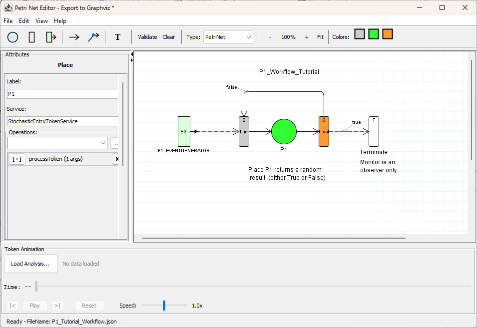
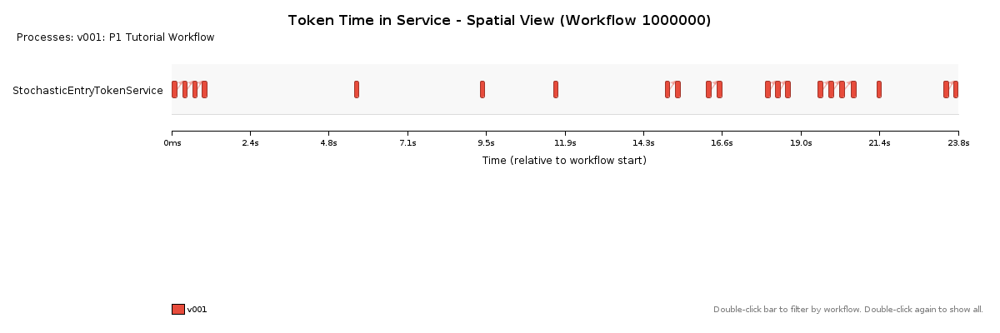

# P1 tutorial: infrastructure, process, execution and results

This tutorial builds and runs the process selected by
[`P1_Tutorial_BuildAndRun.xml`](btsn.petrinet.ProjectLoader/P1_Tutorial_BuildAndRun.xml).
An event generator sends a token to P1. P1 invokes
`StochasticEntryTokenService.processToken`; its function returns a fresh `true`
or `false` result. The output transition terminates on `true` and sends the same
workflow back to P1 on `false`. Monitor collects observations separately.

[](#2-define-the-process)

*The P1 process design in ProcessEditor. P1 invokes its bound function; `true`
terminates and `false` loops back. Monitor observes outside the process path.*

Follow the four stages below to build and run this example:

| Step | What you do | Repository reference |
|---|---|---|
| **1. Define the infrastructure** | Set the physical node, channel, address and service capability | [Infrastructure and contract settings](#1-define-the-infrastructure) |
| **2. Define the process** | Build the design above, bind `processToken`, set its guards, validate and save | [ProcessEditor walkthrough](#2-define-the-process) |
| **3. Run the tutorial** | Use `P1_Tutorial_BuildAndRun.xml` through the supplied local configuration to build, initialize, deploy and collect | [Run instructions and launchers](#3-run-the-tutorial) |
| **4. Show the results** | Check root completion, inspect timing/spatial views and replay the captured observations | [Measured results and reusable artefacts](#4-show-the-results) |

This tutorial links the editable infrastructure and process definitions, matching
deployment files, launchers and captured result exports so you can inspect the
complete example in this repository.

The supplied files let you run the finished example first, or reconstruct its
infrastructure and process in the editor. All commands below start at the
repository root.

## Before you start

Use **JDK 15 or later** and **Apache Ant 1.10.2 or later**. In Eclipse, import
existing projects with **Copy projects into workspace** unchecked. Include
`btsn.common`, `btsn.services`, `btsn.common.eventgenerators`,
`btsn.common.Monitor`, `btsn.petrinet.ProjectLoader`, `btsn.workflowEditor` and the
numbered `btsn.rpso.places.p1`–`p6` projects. Run Ant with a JDK, so its compiler
is available.

Run [`com.editor.ProcessEditor`](btsn.workflowEditor/src/com/editor/ProcessEditor.java)
from `btsn.workflowEditor` as a Java application. Its **File → New** menu has
separate **Infrastructure Definition** and **Process Definition** editors.

The local configuration below uses `127.0.0.1`: P1, the generator and Monitor
run on the same computer. The original launcher retains its existing LAN
configuration. Stop an earlier local workflow before starting this one.
Initialization resets the selected P1 runtime and Monitor databases; retain any
previous results you need before running it.

## 1. Define the infrastructure

Infrastructure defines network resources and the service operation available
on each physical node. It does not define the loop or its routing guards.
Editable definitions are grouped by domain in
[`InfrastructureDefinitionFolder`](btsn.common/InfrastructureDefinitionFolder/README.md);
this tutorial uses its `petrinet` subfolder.

### Create the physical node

Choose **File → New → Infrastructure Definition**. In **Physical node network**,
click **Add node** and enter:

| Node | Channel | Address | Base Port Start | Base Port End |
|---|---|---|---|---|
| `P1` | `ip0` | `127.0.0.1` | `4001` | `4099` |

These are base-port values used by the platform's channel mapping. The runtime
logs show the resolved transport ports. P1 is the physical node; its runtime
service identity is `P1_Place`.

### Declare P1's capability and contract

Select the P1 row, click **Add capability**, and fill in **Node capabilities**:

| Node | Service | Operation | Return Attribute | Base Port |
|---|---|---|---|---|
| `P1` | `StochasticEntryTokenService` | `processToken` | `token` | `4001` |

Select that capability, then click **Add argument** in its **Arguments** panel:

| Name | Type | Value | Required |
|---|---|---|---|
| `token` | `String` | `String` | Unchecked |

The contract is `token → token`. The service name selects the existing
implementation in the [P1 tutorial service catalogue](btsn.common/BusinessServiceDefinitions/P1_Tutorial_Local.json).
The packaged [service implementation](btsn.common/src/org/btsn/services/StochasticEntryTokenService.java)
runs inside the generic P1 host; entering a service name does not create an
implementation.

### Save and generate the configuration

1. Click **Save...**, open the `petrinet` subfolder of the infrastructure
   definitions folder, and save the definition as
   `btsn.common/InfrastructureDefinitionFolder/petrinet/P1_Tutorial_LocalInfrastructure.json`.
2. Click **Generate Configuration**. The editor validates the definition and
   writes the service's canonical binding under `btsn.common/ServiceAttributeBindings`,
   plus `btsn.common/RuleBase/Generated/InfrastructureDeployment.ruleml.xml`.
3. Copy that generated deployment file to
   `btsn.services/deployments/models/P1_Tutorial_LocalInfrastructure.ruleml.xml`.
   This is the deployment snapshot selected by the local tutorial launcher.

Ready-to-use versions of both files are included:

- [Editable infrastructure JSON](btsn.common/InfrastructureDefinitionFolder/petrinet/P1_Tutorial_LocalInfrastructure.json).
- [Matching deployment rules](btsn.services/deployments/models/P1_Tutorial_LocalInfrastructure.ruleml.xml).
- [Local deployment profile](btsn.services/deployments/models/P1_Tutorial_LocalDeployment.json), which selects that JSON, the P1-only service catalogue and the initialization/collection services.

The launcher copies the selected deployment snapshot into its working runtime.
If you change the infrastructure address or base port, save the JSON, generate
configuration again and update the matching snapshot. Changing only a launch
mode to `local` does not change the configured destination address.

**Monitor remains an observation service.** Its existing rules provide
initialization and collection operations. Do not add Monitor to the P1 process
or declare it as P1's business capability. P1 initialization and collection use
the existing `P1_InitializationService` and `P1_CollectorService` definitions.

The original launcher selects
[`StochasticLoopModels_Infrastructure.json`](btsn.common/InfrastructureDefinitionFolder/petrinet/StochasticLoopModels_Infrastructure.json)
and its [deployment snapshot](btsn.services/deployments/models/StochasticLoopInfrastructure.ruleml.xml).
That infrastructure also declares a P2 capability for other stochastic models;
this one-place tutorial uses P1 only. The supplied local variant needs one node and selects a P1-only catalogue.
Every active catalogue operation must have a matching deployed capability;
using the two-service catalogue with only P1 would prevent capability resolution.

<a id="build-this-process-in-processeditor"></a>

## 2. Define the process

To inspect the finished design, choose **File → Load (.json)** and open
[`P1_Tutorial_Workflow.json`](btsn.common/ProcessDefinitionFolder/petrinet/Workflow/P1_Tutorial_Workflow.json).
To build it yourself, choose **File → New → Process Definition** and select
**PetriNet** in the toolbar's **Type** field.

### Place the five elements

Select a palette tool and click the canvas to place a shape. Configure each
shape in the **Attributes** panel. Arrange the generator, input transition,
place, output transition and terminal transition from left to right.

| Palette tool | Label | Attributes |
|---|---|---|
| Event Generator | `P1_EVENTGENERATOR` | Rate (ms): `1000`; Version: `v001`; Fork Children: `0` |
| Transition | `T_in_P1` | Transition Type: `T_in`; Node Type: `EdgeNode`; Buffer: `50` |
| Place | `P1` | Service: `StochasticEntryTokenService` |
| Transition | `T_out_P1` | Transition Type: `T_out`; Node Type: `GatewayNode` |
| Transition | `Terminate` | Transition Type: `Other`; Node Type: `TerminateNode` |

Set **Transition Type** before **Node Type**; the editor sets **Node Value**
automatically. Labels must be unique. The supplied definition uses internal ID
`T_in_Model_Terminate` for the transition displayed as `Terminate`; the
`TerminateNode` setting gives a newly labelled terminal transition the same role.

The supplied JSON's generator Version field currently stores `v002`. The
launcher's `rule.version=v001` selects the actual version for this tutorial.
Its event-trigger CSV supplies the firing schedule; the generator's canvas
Rate and Version fields do not replace those launch settings.

### Bind the operation to P1

Select P1. In **Operations**, enter `processToken`, then click the operation
**+** button. Expand it with **[+]**. Enter argument name `token` and value
`String`, leave its type `String` and **Required** checkbox unchecked, then click
the argument row's **+** button. The panel should show **processToken (1 args)**.

The returned attribute is `token`, matching the infrastructure contract. The
current process panel edits the operation and its inputs; its single-input
binding generator uses that output attribute. Infrastructure and process must
name the same service operation and input/output contract.

### Connect the nodes and set the guards

Use **Arrow (drag)**, or **Arrow (click waypoints)** to give the return route
bends. Connect:

| Source | Target | Arrow label | Guard Condition | Decision Value |
|---|---|---|---|---|
| `P1_EVENTGENERATOR` | `T_in_P1` | Blank | Blank | Blank |
| `T_in_P1` | `P1` | Blank | Blank | Blank |
| `P1` | `T_out_P1` | Blank | Blank | Blank |
| `T_out_P1` | `Terminate` | `true` | `DECISION_EQUAL_TO` | `true` |
| `T_out_P1` | `T_in_P1` | `false` | `DECISION_EQUAL_TO` | `false` |

Select the two output arrows and enter their guard fields. **The label is a
caption; Guard Condition and Decision Value define the route.** Leave
**Endpoint** blank. The supplied model marks the generator and terminal
publication links as **Network Connection**; its false loop is solid.

T_in receives and buffers a token, P invokes the bound function, and T_out
routes the result. `false` repeats this activity with the same root token;
`true` records completion. The stochastic function selects a fresh Boolean
(default probability of `true`: 0.5), independently of the incoming Boolean.
Its implementation includes an acceptance delay, so elapsed and queue times
reflect the supplied demo function as well as the running fabric.

### Validate and save

Click **Validate** or **Edit → Validate**. Resolve missing or duplicate labels,
incomplete operation definitions and invalid connections. Save a reconstructed
practice model with **File → Save As (.json)** to:

```text
btsn.common/ProcessDefinitionFolder/petrinet/Workflow/P1_Editor_Practice.json
```

Reopen it with **File → Load (.json)** to verify the saved design. Keeping the
practice file separate preserves the supplied tutorial for comparison. Editor
validation checks the structure; deployment also checks bindings and host
capabilities. The editor's **Play** control replays observations; it does not
start a distributed run.

## 3. Run the tutorial

### Run the supplied local configuration

The [local launcher](btsn.petrinet.ProjectLoader/P1_Tutorial_Local_BuildAndRun.xml)
imports `P1_Tutorial_BuildAndRun.xml` and selects the local infrastructure and
deployment profile from stage 1. It uses the original workflow phases unchanged.

In Eclipse, right-click **P1_Tutorial_Local_BuildAndRun.xml** and choose
**Run As → Ant Build**. Select its default **run-complete-workflow** target.
From a terminal at the repository root:

```sh
ant -f btsn.petrinet.ProjectLoader/P1_Tutorial_Local_BuildAndRun.xml
```

The initial build packages the service, shared infrastructure, generic hosts,
event generators and Monitor. No separate clean/package command is needed.
Working P1 configuration and its database are isolated under
`btsn.services/target/launchers/P1_Tutorial_Local_BuildAndRun`.

| Setting | Default | Meaning |
|---|---|---|
| `rule.version` | `v001` | Workflow rules and token version |
| `workflow.process.name` | `petrinet/Workflow/P1_Tutorial_Workflow` | Process JSON path relative to `ProcessDefinitionFolder`, without `.json` |
| `target.place` | `P1_Place` | Physical runtime destination |
| `target.operation` | `processToken` | Bound operation |
| `event.generator.id` | `P1_EVENTGENERATOR` | Generator identity in the process |
| `mode` | `1` | Normal single-token (`EDGE_NODE`) injection |
| `token.count` | `10` | Maximum tokens fired from the event-trigger sequence |
| `token.expire` | `120000` | Token validity, in milliseconds |
| `query.version` | `v001` | Version requested by the collector |

For a reconstructed practice model, set **workflow.process.name** in the
Eclipse Ant configuration's **Properties** tab to
`petrinet/Workflow/P1_Editor_Practice`, or use:

```sh
ant -f btsn.petrinet.ProjectLoader/P1_Tutorial_Local_BuildAndRun.xml -Dworkflow.process.name=petrinet/Workflow/P1_Editor_Practice
```

Keep `P1_EVENTGENERATOR` and `processToken` so the model matches the launcher.
Remove that override to return to the supplied process. To fire twenty tokens,
use `-Dtoken.count=20`; the firing schedule comes from
[`V001_EventTriggeringFile.csv`](btsn.common.eventgenerators/EventTriggeringFile/V001_EventTriggeringFile.csv).

### Follow the three execution phases

The four tutorial stages describe your design/run workflow. The XML's three
runtime phases have a different purpose:

| XML phase | Action | Definition used |
|---|---|---|
| 1 — Database initialization | Initialize P1 and Monitor using administrative version `v999` | [P1_Initialization.json](btsn.common/ProcessDefinitionFolder/petrinet/Initializers/P1_Initialization.json) |
| 2 — Workflow execution | Deploy the P1 loop as `v001`, then fire up to ten root tokens | [P1_Tutorial_Workflow.json](btsn.common/ProcessDefinitionFolder/petrinet/Workflow/P1_Tutorial_Workflow.json) |
| 3 — Data collection | Request P1 observations for `v001` and write them to Monitor | [P1_Collector.json](btsn.common/ProcessDefinitionFolder/petrinet/Collectors/P1_Collector.json) |

The console reports each phase and prints the P1 and Monitor output paths.
Locally launched hosts remain running after the completion banner. Allow
Monitor's collection processing to finish, then stop that Ant run (Eclipse's
**Terminate** control, or **Ctrl+C** in the terminal). This releases the embedded
Derby database before a separate analyzer or chart JVM opens it.

The output files are `P1_Place.out.txt` and `MonitorService.out.txt` beside the
launcher. Monitor's collected database is
`btsn.common.Monitor/ServiceAnalysisDataBase`. These working results are ignored
by Git; the tutorial's captured text, CSV and chart exports are explicitly
versioned under `docs/tutorials/p1/results`.

### Use the original LAN launcher

To use the original deployment instead, run:

```sh
ant -f btsn.petrinet.ProjectLoader/P1_Tutorial_BuildAndRun.xml
```

Keep its infrastructure JSON and deployment snapshot addresses consistent with
your host network. In default **auto** mode the launcher starts a component
locally only when `ip0` belongs to that computer; otherwise the component must
already run on its configured remote host. The local wrapper avoids a LAN
address change for the single-computer walkthrough.

## 4. Show the results

### Analyze the collected run

After stopping the completed run, execute:

```sh
ant -f btsn.petrinet.ProjectLoader/P1_Tutorial_Local_BuildAndRun.xml analyse
```

In Eclipse, choose the same XML's **analyse** target, or run
`org.btsn.derby.Analysis.PetriNetAnalyzer` with program argument `--all` and
working directory **btsn.common.Monitor**. Save the analyzer console output to
use with the process editor's replay controls.

Read the [captured results](docs/tutorials/p1/results/README.md) for the measured
reference run, its completion counts and per-root timings. The linked exports
come from the supplied P1 process and the local configuration above. Exact
Boolean outcomes, repeat counts and timings vary between runs.

The captured reference run generated and completed **10 roots**, made **21 P1
visits** (including **11 repeat visits**) and had no incomplete roots, forks or
joins. Per-root elapsed times ranged from **231 to 1,253 ms**.

For a complete ten-token run, look for **10 generated root workflows and 10
completed roots**, with no forks or joins. Count roots independently of place
visits: a `false` result causes another visit by the same root. A terminal event
records successful completion; an expired or unfinished root is not a completed
workflow. Administrative `v999` initialization/collection activity is separate.

### Export artefacts from your run

After collection completes and you stop the workflow hosts, run:

```sh
ant -f btsn.petrinet.ProjectLoader/P1_Tutorial_Local_BuildAndRun.xml export-tutorial-results
```

The [export helper](docs/tutorials/p1/ExportP1TutorialResults.java) uses the
existing analyzer and chart classes to write replayable analysis, per-root CSV,
PNG charts, text summaries, LaTeX exports and capture metadata to
`btsn.services/target/tutorial-results/P1`. It checks that the supplied P1
process completed the expected number of roots before exporting. For a run
with twenty tokens, add `-Dtoken.count=20` to this export command too.

Use `-Dtutorial.results.dir=/absolute/path/to/results` to choose another
output folder. The default keeps your exports separate from the committed
reference example. Export before running initialization again, which clears
Monitor's collected data. To preserve a run made from a modified practice
model, use the analyzer and viewer exports directly and retain that model
alongside them.

### Inspect the current timing chart and spatial view

Run these Java applications from `btsn.common.Monitor`, with that project as the
working directory:

| Viewer | What to inspect |
|---|---|
| `org.btsn.derby.Analysis.SwingGanttChart_WithLatency_v1d` | Measured root-workflow elapsed time and maximum observed service-visit queue wait |
| `org.btsn.derby.Analysis.WorkflowSpatialView` | P1 service activity over time, including repeated loop visits |


*The current chart implementation is used unchanged. Bars show measured elapsed
time from generation to completion; its default black diamonds show the maximum
observed queue wait on a service visit. Queue wait is a separate measurement,
not total waiting time summed across the loop.*



*The spatial view labels the bound service. Repeated activity belongs to the
same root workflow; observation and administrative operations do not turn
Monitor into a P1 business activity.*

### Replay the observations on the design

1. Open `P1_Tutorial_Workflow.json` in ProcessEditor.
2. Click **Load Analysis...** and select the
   [captured analyzer output](docs/tutorials/p1/results/analysis.txt), or the
   saved output from your own run.
3. Use **Play**, step controls and **Speed** to follow the tokens through the
   model. A `false` result returns to P1; a `true` result reaches termination.

Use the process JSON that actually produced the observations. For a practice
run, load `P1_Editor_Practice.json` and that run's analysis together. Replaying
observations does not deploy or rerun the process.

### If your results differ

| Observation | Check |
|---|---|
| P1 or Monitor was skipped at startup | Read the resolved deployment mode and `ip0` address; use the supplied local wrapper for this walkthrough |
| No data appears in the viewers | Confirm Phase 3 finished in Monitor's log; use `btsn.common.Monitor` as the viewer working directory |
| Derby reports another active instance | Stop the previous local Ant run and other database-opening viewers before analyzing |
| Fewer completed roots than generated | Inspect unfinished roots and token expiry; allow workflow completion before requesting collection |
| More visits than root tokens | This is expected when `false` loops; compare generated/completed roots separately from visits |
| A modified model did not run | Check `workflow.process.name`, save the JSON and start a fresh initialized run |

## Repository artefacts

| Artefact | Role |
|---|---|
| [P1_Tutorial_LocalInfrastructure.json](btsn.common/InfrastructureDefinitionFolder/petrinet/P1_Tutorial_LocalInfrastructure.json) | Editable single-node infrastructure |
| [P1_Tutorial_LocalInfrastructure.ruleml.xml](btsn.services/deployments/models/P1_Tutorial_LocalInfrastructure.ruleml.xml) | Matching loopback network/capability deployment snapshot |
| [P1_Tutorial_Local.json](btsn.common/BusinessServiceDefinitions/P1_Tutorial_Local.json) | Active catalogue containing the P1 entry capability only |
| [P1_Tutorial_LocalDeployment.json](btsn.services/deployments/models/P1_Tutorial_LocalDeployment.json) | Catalogue and infrastructure selection |
| [P1_Tutorial_Workflow.json](btsn.common/ProcessDefinitionFolder/petrinet/Workflow/P1_Tutorial_Workflow.json) | Editable process design |
| [process-editor-p1-tutorial.png](images/process-editor-p1-tutorial.png) | Process-editor image used in this tutorial |
| [P1_Tutorial_BuildAndRun.xml](btsn.petrinet.ProjectLoader/P1_Tutorial_BuildAndRun.xml) | Original build-and-run phases |
| [P1_Tutorial_Local_BuildAndRun.xml](btsn.petrinet.ProjectLoader/P1_Tutorial_Local_BuildAndRun.xml) | Portable local configuration for those phases |
| [Captured results and export helper](docs/tutorials/p1/results/README.md) | Analyzer output, per-root CSV, current chart images and capture provenance |

## Run an example

1. Use **JDK 15+** and **Apache Ant 1.10.2+**. In Eclipse, ensure the Ant launch uses
   a JDK so the Java compiler is available.
2. Import the repository's projects with **File → Import → General → Existing
   Projects into Workspace**, leaving **Copy projects into workspace** unchecked.
   Existing workspaces should also import `btsn.services`, the generic
   `btsn.rpso.places.p1`–`p6` projects, and `btsn.financial.ProjectLoader`.
3. Choose a launcher below, right-click the XML and select **Run As → Ant Build**.
   Use its default `run-complete-workflow` target. It builds the required JARs,
   prepares the configured runtime, starts local components, runs the workflow
   phases and collects observations. No separate `clean`/`package` step is needed.
4. After collection, run the launcher's `analyse` target or run `PetriNetAnalyzer`
   in `btsn.common.Monitor`, package `org.btsn.derby.Analysis`.

| Example | Ant entry point |
|---|---|
| Single-place tutorial | [P1_Tutorial_BuildAndRun.xml](btsn.petrinet.ProjectLoader/P1_Tutorial_BuildAndRun.xml) |
| P1–P4 fork/join model | [P1_P2_P3_P4_BuildAndRun.xml](btsn.petrinet.ProjectLoader/P1_P2_P3_P4_BuildAndRun.xml) |
| Six-place double-join model | [P1_to_P6_Double_Join_Workflow.xml](btsn.petrinet.ProjectLoader/P1_to_P6_Double_Join_Workflow.xml) |
| Emergency department | [Emergency_Department_BuildAndRun.xml](btsn.healthcare.ProjectLoader/Emergency_Department_BuildAndRun.xml) |
| Full Financial application | [FinancialSystem_P1_P5_BuildAndRun.xml](btsn.financial.ProjectLoader/FinancialSystem_P1_P5_BuildAndRun.xml) |
| Concurrent healthcare versions | [Triple_Workflow_Emergencey_Department_Concurrent.xml](btsn.healthcare.ProjectLoader/Triple_Workflow_Emergencey_Department_Concurrent.xml) |

The concurrent launcher's existing filename includes `Emergencey`; use the file
as named. The loader guides list further scenarios and phase-only targets:
[healthcare](btsn.healthcare.ProjectLoader/README.md),
[Financial](btsn.financial.ProjectLoader/README.md), and
[Petri-net models](btsn.petrinet.ProjectLoader/README.md).

Local/remote startup follows the launcher's deployment profile. In `auto` mode,
the configured channel address must belong to this machine for a component to
start locally. Remote hosts must already be running with the matching JARs and
configuration. Stop the previous Ant run before starting another launcher on the
same ports. Initialization targets reset the selected runtime databases; collect
or archive results before starting a fresh initialized run.

For the single-place model walkthrough, follow [the four stages above](#1-define-the-infrastructure).

## Author

Alexander Cameron
